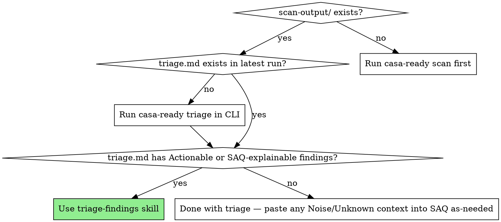

# V0.5.0 — Triage CLI + `triage-findings` Skill — Implementation Plan

> **For agentic workers:** REQUIRED SUB-SKILL: Use superpowers:subagent-driven-development (recommended) or superpowers:executing-plans to implement this plan task-by-task. Steps use checkbox (`- [ ]`) syntax for tracking.
>
> **Spec:** `docs/superpowers/specs/2026-05-01-v0.5.0-triage-cli-and-skill-design.md`
>
> **Worktree:** This plan should be executed in a dedicated worktree (`.worktrees/v0.5.0-triage` or similar). Use `superpowers:using-git-worktrees` to set it up before starting Task 1.

**Goal:** Ship the casa-ready Claude Code plugin's first skill (`triage-findings`) plus the `casa-ready triage` CLI command that backs it, so a developer in Claude Code can triage a CASA scan output into Actionable patches and SAQ-ready answer text.

**Architecture:** Three layers in one repo. (1) The CLI (`casa-ready triage`) reads `scan-output/<env>/<ts>/results.json` from each target, classifies findings against a markdown rules KB at `configs/casa/rules/`, and writes one aggregated `triage.md` (plus optional `triage.json`) at the run root. (2) The plugin (`plugin/`) ships a `triage-findings` skill that shells out to the CLI, then drafts patches for Actionable findings by reading the user's actual code; vendored `superpowers:systematic-debugging` and `superpowers:test-driven-development` skills enforce discipline. (3) The rules KB is markdown-with-YAML-frontmatter — CLI reads frontmatter for classification, skill reads body for explanation/remediation context. New ZAP alert type → one PR adds a markdown file.

**Tech Stack:** Node 20+, ESM modules, vitest, zod, js-yaml. No new runtime deps (inline frontmatter parser using existing js-yaml). Plugin distribution via direct git URL install today; marketplace later.

---

## File Structure

**New files (CLI):**
- `cli/commands/triage.js` — command entrypoint, parses argv, calls orchestration
- `cli/lib/triage/index.js` — orchestrates classify → render-md → render-json
- `cli/lib/triage/find-latest-scan.js` — auto-discovers newest `scan-output/<env>/<ts>/`
- `cli/lib/triage/rules-loader.js` — globs `configs/casa/rules/*.md`, parses frontmatter, indexes by ZAP plugin ID
- `cli/lib/triage/classify.js` — reads results.json + rules index → classified findings array
- `cli/lib/triage/render-md.js` — classified findings → markdown string
- `cli/lib/triage/render-json.js` — classified findings → JSON object

**New files (Rules KB — 9 markdown files):**
- `configs/casa/rules/cross-domain-misconfiguration.md`
- `configs/casa/rules/application-error-disclosure.md`
- `configs/casa/rules/information-disclosure-suspicious-comments.md`
- `configs/casa/rules/information-disclosure-sensitive-info-in-url.md`
- `configs/casa/rules/cross-domain-javascript-source-file-inclusion.md`
- `configs/casa/rules/csp-header-not-set.md`
- `configs/casa/rules/x-content-type-options-missing.md`
- `configs/casa/rules/strict-transport-security-not-set.md`
- `configs/casa/rules/x-frame-options-not-set.md`

**New files (Plugin):**
- `plugin/plugin.json`
- `plugin/README.md`
- `plugin/skills/triage-findings/SKILL.md`
- `plugin/skills/_vendored/systematic-debugging/SKILL.md` (copied from superpowers)
- `plugin/skills/_vendored/test-driven-development/SKILL.md` (copied from superpowers)
- `plugin/skills/_vendored/systematic-debugging/<companion files>` (copied verbatim)
- `plugin/skills/_vendored/test-driven-development/<companion files>` (copied verbatim)

**New files (Scripts):**
- `scripts/sync-vendored.sh`

**New files (Tests):**
- `tests/triage/rules-loader.test.js`
- `tests/triage/classify.test.js`
- `tests/triage/find-latest-scan.test.js`
- `tests/triage/render-md.test.js`
- `tests/triage/render-json.test.js`
- `tests/rules-kb.test.js`
- `tests/plugin/skill-validate.test.js`
- `tests/integration/triage-e2e.test.js`
- `tests/triage/fixtures/magpipe-results.json`
- `tests/triage/fixtures/empty-scan.json`
- `tests/triage/fixtures/all-unknown-scan.json`

**New files (Distribution):**
- `.npmignore`

**Modified files:**
- `bin/casa-ready.js` — register `triage` subcommand
- `cli/commands/scan.js` — add "Next step: casa-ready triage" hint at end of run
- `package.json` — bump version to 0.5.0
- `README.md` — full rewrite (plugin-primary framing)
- `CHANGELOG.md` — add v0.5.0 entry

---

## Task 1: Project setup — version bump, .npmignore, scaffold dirs

**Files:**
- Modify: `package.json` (version field)
- Create: `.npmignore`
- Create: `cli/lib/triage/` (empty dir)
- Create: `configs/casa/rules/` (empty dir)
- Create: `plugin/` (empty dir)
- Create: `tests/triage/fixtures/` (empty dir)
- Create: `tests/plugin/` (empty dir)
- Create: `scripts/` (verify exists from prior work)

- [ ] **Step 1: Bump version in package.json**

Open `package.json`. Change `"version": "0.4.4"` to `"version": "0.5.0"`.

- [ ] **Step 2: Create .npmignore to keep plugin/ out of the npm tarball**

Create `.npmignore`:

```
# Plugin distribution lives in .claude plugin install path, not npm
plugin/

# Dev/repo-only
docs/
scan-output/
.worktrees/
.claude/
tests/
*.test.js

# IDE / OS junk
.DS_Store
.vscode/
.idea/
```

- [ ] **Step 3: Create empty directories the rest of the plan needs**

```bash
mkdir -p cli/lib/triage configs/casa/rules tests/triage/fixtures tests/plugin plugin/skills/_vendored
```

- [ ] **Step 4: Verify nothing else broke**

```bash
npm test
```

Expected: All existing tests pass (153/153). The empty dirs and version bump don't change behavior.

- [ ] **Step 5: Commit**

```bash
git add package.json .npmignore cli/lib/triage configs/casa/rules tests/triage/fixtures tests/plugin plugin
git commit -m "chore: scaffold v0.5.0 directory structure + version bump"
```

---

## Task 2: Build rules-loader.js with inline frontmatter parser

**Files:**
- Create: `cli/lib/triage/rules-loader.js`
- Create: `tests/triage/rules-loader.test.js`

- [ ] **Step 1: Write the failing test**

Create `tests/triage/rules-loader.test.js`:

```javascript
import { describe, it, expect } from 'vitest';
import { parseRuleFile, loadRulesIndex } from '../../cli/lib/triage/rules-loader.js';
import { mkdtemp, writeFile, rm } from 'node:fs/promises';
import { tmpdir } from 'node:os';
import path from 'node:path';

describe('parseRuleFile', () => {
  it('parses frontmatter and body', () => {
    const raw = `---
name: Test Rule
slug: test-rule
zap_plugin_ids: [10001, 10002]
zap_alert_names: ["Test Alert"]
cwe: 200
category: actionable
saq_section: "1.1"
saq_section_title: Test Section
severity_override: null
---

# Test Rule

## What ZAP detects
Test detection content.
`;
    const parsed = parseRuleFile(raw, 'test-rule.md');
    expect(parsed.frontmatter.name).toBe('Test Rule');
    expect(parsed.frontmatter.zap_plugin_ids).toEqual([10001, 10002]);
    expect(parsed.frontmatter.category).toBe('actionable');
    expect(parsed.body).toContain('## What ZAP detects');
  });

  it('throws on missing closing frontmatter delimiter', () => {
    const raw = `---
name: Broken
no closing delimiter
`;
    expect(() => parseRuleFile(raw, 'broken.md')).toThrow(/frontmatter/i);
  });

  it('throws on invalid YAML in frontmatter', () => {
    const raw = `---
name: [unclosed
---
body
`;
    expect(() => parseRuleFile(raw, 'bad-yaml.md')).toThrow();
  });
});

describe('loadRulesIndex', () => {
  it('indexes rule files by zap_plugin_id', async () => {
    const dir = await mkdtemp(path.join(tmpdir(), 'rules-test-'));
    try {
      await writeFile(path.join(dir, 'rule-a.md'), `---
name: A
slug: rule-a
zap_plugin_ids: [10001]
zap_alert_names: ["Alert A"]
cwe: 200
category: actionable
saq_section: "1.1"
saq_section_title: Sec
severity_override: null
---
body A`, 'utf8');
      await writeFile(path.join(dir, 'rule-b.md'), `---
name: B
slug: rule-b
zap_plugin_ids: [10002, 10003]
zap_alert_names: ["Alert B"]
cwe: 264
category: noise
severity_override: null
---
body B`, 'utf8');

      const index = await loadRulesIndex(dir);
      expect(index.byPluginId.get(10001).frontmatter.slug).toBe('rule-a');
      expect(index.byPluginId.get(10002).frontmatter.slug).toBe('rule-b');
      expect(index.byPluginId.get(10003).frontmatter.slug).toBe('rule-b');
      expect(index.all).toHaveLength(2);
    } finally {
      await rm(dir, { recursive: true, force: true });
    }
  });

  it('throws on duplicate plugin IDs across rule files', async () => {
    const dir = await mkdtemp(path.join(tmpdir(), 'rules-test-'));
    try {
      const fm = (slug) => `---
name: ${slug}
slug: ${slug}
zap_plugin_ids: [10001]
zap_alert_names: ["X"]
cwe: 200
category: actionable
saq_section: "1.1"
saq_section_title: Sec
severity_override: null
---
body`;
      await writeFile(path.join(dir, 'a.md'), fm('a'), 'utf8');
      await writeFile(path.join(dir, 'b.md'), fm('b'), 'utf8');

      await expect(loadRulesIndex(dir)).rejects.toThrow(/duplicate plugin id/i);
    } finally {
      await rm(dir, { recursive: true, force: true });
    }
  });
});
```

- [ ] **Step 2: Run test to verify it fails**

```bash
npm test -- tests/triage/rules-loader.test.js
```

Expected: FAIL — `parseRuleFile` and `loadRulesIndex` not exported (module not found).

- [ ] **Step 3: Implement rules-loader.js**

Create `cli/lib/triage/rules-loader.js`:

```javascript
import { readdir, readFile } from 'node:fs/promises';
import path from 'node:path';
import yaml from 'js-yaml';

/**
 * Parse a rule file's raw markdown into { frontmatter, body }.
 * Frontmatter is YAML between `---\n` and `\n---\n` at the very start of the file.
 */
export function parseRuleFile(raw, sourceFile = '<unknown>') {
  if (!raw.startsWith('---\n')) {
    throw new Error(`Rule file ${sourceFile}: missing opening frontmatter delimiter (expected first line to be '---')`);
  }
  const closeIdx = raw.indexOf('\n---\n', 4);
  if (closeIdx === -1) {
    throw new Error(`Rule file ${sourceFile}: missing closing frontmatter delimiter`);
  }
  const yamlBlock = raw.slice(4, closeIdx);
  const body = raw.slice(closeIdx + 5);

  let frontmatter;
  try {
    frontmatter = yaml.load(yamlBlock);
  } catch (err) {
    throw new Error(`Rule file ${sourceFile}: invalid YAML frontmatter: ${err.message}`);
  }
  if (!frontmatter || typeof frontmatter !== 'object') {
    throw new Error(`Rule file ${sourceFile}: frontmatter parsed to non-object`);
  }
  return { frontmatter, body, sourceFile };
}

/**
 * Glob a directory for *.md, parse each, and build an index by ZAP plugin ID.
 * Throws if two rule files claim the same plugin ID (silent shadowing would be a bug).
 */
export async function loadRulesIndex(rulesDir) {
  const entries = await readdir(rulesDir);
  const mdFiles = entries.filter((e) => e.endsWith('.md')).sort();

  const all = [];
  const byPluginId = new Map();
  const byAlertName = new Map();

  for (const filename of mdFiles) {
    const fullPath = path.join(rulesDir, filename);
    const raw = await readFile(fullPath, 'utf8');
    const parsed = parseRuleFile(raw, filename);
    all.push(parsed);

    const pluginIds = parsed.frontmatter.zap_plugin_ids ?? [];
    for (const id of pluginIds) {
      if (byPluginId.has(id)) {
        const other = byPluginId.get(id).sourceFile;
        throw new Error(
          `Duplicate plugin ID ${id} in rule files: ${other} and ${filename}`
        );
      }
      byPluginId.set(id, parsed);
    }

    const alertNames = parsed.frontmatter.zap_alert_names ?? [];
    for (const name of alertNames) {
      // Alert-name matching is fuzzy fallback — duplicates are allowed (lower precedence than ID match)
      if (!byAlertName.has(name)) byAlertName.set(name, parsed);
    }
  }

  return { all, byPluginId, byAlertName };
}
```

- [ ] **Step 4: Run test to verify it passes**

```bash
npm test -- tests/triage/rules-loader.test.js
```

Expected: PASS — all 5 tests green.

- [ ] **Step 5: Commit**

```bash
git add cli/lib/triage/rules-loader.js tests/triage/rules-loader.test.js
git commit -m "feat(triage): add rules-loader with frontmatter parser and plugin-ID index"
```

---

## Task 3: Build the rules-KB validation test (the gate)

**Files:**
- Create: `tests/rules-kb.test.js`

This test fails until rule files exist (Tasks 4–12). That's intentional — it's the contract every rule file must satisfy.

- [ ] **Step 1: Write the validation test**

Create `tests/rules-kb.test.js`:

```javascript
import { describe, it, expect, beforeAll } from 'vitest';
import { loadRulesIndex } from '../cli/lib/triage/rules-loader.js';
import path from 'node:path';
import { fileURLToPath } from 'node:url';

const __dirname = path.dirname(fileURLToPath(import.meta.url));
const RULES_DIR = path.join(__dirname, '..', 'configs', 'casa', 'rules');

const VALID_CATEGORIES = new Set(['actionable', 'saq-explainable', 'noise']);

describe('configs/casa/rules/ KB validation', () => {
  let index;

  beforeAll(async () => {
    index = await loadRulesIndex(RULES_DIR);
  });

  it('contains at least one rule file', () => {
    expect(index.all.length).toBeGreaterThan(0);
  });

  it('every rule has a valid category', () => {
    for (const rule of index.all) {
      expect(
        VALID_CATEGORIES.has(rule.frontmatter.category),
        `${rule.sourceFile} has invalid category: ${rule.frontmatter.category}`
      ).toBe(true);
    }
  });

  it('every rule has zap_plugin_ids as a non-empty array of integers', () => {
    for (const rule of index.all) {
      const ids = rule.frontmatter.zap_plugin_ids;
      expect(Array.isArray(ids), `${rule.sourceFile}: zap_plugin_ids must be array`).toBe(true);
      expect(ids.length, `${rule.sourceFile}: zap_plugin_ids must be non-empty`).toBeGreaterThan(0);
      for (const id of ids) {
        expect(Number.isInteger(id), `${rule.sourceFile}: plugin ID ${id} not an integer`).toBe(true);
      }
    }
  });

  it('every rule has zap_alert_names as a non-empty array of strings', () => {
    for (const rule of index.all) {
      const names = rule.frontmatter.zap_alert_names;
      expect(Array.isArray(names), `${rule.sourceFile}: zap_alert_names must be array`).toBe(true);
      expect(names.length, `${rule.sourceFile}: zap_alert_names must be non-empty`).toBeGreaterThan(0);
    }
  });

  it('every actionable rule has a saq_section and a non-empty body', () => {
    for (const rule of index.all) {
      if (rule.frontmatter.category !== 'actionable') continue;
      expect(rule.frontmatter.saq_section, `${rule.sourceFile}: actionable rule missing saq_section`).toBeTruthy();
      expect(rule.body.trim().length, `${rule.sourceFile}: empty body`).toBeGreaterThan(50);
    }
  });

  it('every actionable rule body has Standard fix pattern and How to spot sections', () => {
    for (const rule of index.all) {
      if (rule.frontmatter.category !== 'actionable') continue;
      expect(rule.body, `${rule.sourceFile}: missing 'Standard fix pattern' section`).toMatch(/##\s+Standard fix pattern/i);
      expect(rule.body, `${rule.sourceFile}: missing 'How to spot' section`).toMatch(/##\s+How to spot/i);
    }
  });

  it('every saq-explainable rule body has SAQ answer template section', () => {
    for (const rule of index.all) {
      if (rule.frontmatter.category !== 'saq-explainable') continue;
      expect(rule.body, `${rule.sourceFile}: missing 'SAQ answer template' section`).toMatch(/##\s+SAQ answer template/i);
    }
  });

  it('every noise rule body explains why it is noise', () => {
    for (const rule of index.all) {
      if (rule.frontmatter.category !== 'noise') continue;
      expect(rule.body, `${rule.sourceFile}: missing explanation in body`).toMatch(/##\s+Why this is (typically )?noise/i);
    }
  });

  it('no two rule files share a ZAP plugin ID (loadRulesIndex enforces this)', async () => {
    // loadRulesIndex throws on duplicate; reaching beforeAll means we passed
    expect(index.byPluginId.size).toBeGreaterThan(0);
  });
});
```

- [ ] **Step 2: Run test to verify it fails**

```bash
npm test -- tests/rules-kb.test.js
```

Expected: FAIL — `loadRulesIndex` throws because `configs/casa/rules/` is empty (or `readdir` returns no .md files; the "at least one rule file" assertion fails).

- [ ] **Step 3: Commit (the failing test stays — Tasks 4-12 will turn it green)**

```bash
git add tests/rules-kb.test.js
git commit -m "test: add rules-KB validation gate (will go green as rule files land)"
```

---

## Task 4: Rule file — Cross-Domain Misconfiguration

**Files:**
- Create: `configs/casa/rules/cross-domain-misconfiguration.md`

- [ ] **Step 1: Write the rule file**

Create `configs/casa/rules/cross-domain-misconfiguration.md`:

````markdown
---
name: Cross-Domain Misconfiguration
slug: cross-domain-misconfiguration
zap_plugin_ids: [10098]
zap_alert_names:
  - "Cross-Domain Misconfiguration"
cwe: 264
category: actionable
saq_section: "2.4"
saq_section_title: Network Security
severity_override: null
fix_pattern: cors-allowlist
---

# Cross-Domain Misconfiguration

## What ZAP detects

ZAP flags any HTTP response with `Access-Control-Allow-Origin: *` (wildcard) or with ACAO matching the request's `Origin` header without a server-side allowlist check. The check fires on responses that include CORS headers — typically API endpoints, but also any HTML/JS resource that opts into cross-origin reads.

## Why this is "Actionable" for CASA

CASA Tier 2 §2.4 (Network Security) requires that authenticated endpoints not expose their responses to arbitrary origins. Wildcard CORS on an endpoint that returns user data is a real cross-origin information leak: any malicious site the user visits can issue a `fetch()` against your API and read the response (provided the user is authenticated via a cookie session — the wildcard explicitly disables the browser's same-origin protection).

## Standard fix pattern

Replace wildcard CORS with an allowlist function. For Supabase Edge Functions, the canonical pattern is:

```typescript
// supabase/functions/_shared/cors.ts
const ALLOWED_ORIGINS = [
  'https://your-app.com',
  'https://staging.your-app.com',
  'http://localhost:3000',
];

export function buildCorsHeaders(origin: string | null) {
  const allowed = origin && ALLOWED_ORIGINS.includes(origin)
    ? origin
    : ALLOWED_ORIGINS[0];
  return {
    'Access-Control-Allow-Origin': allowed,
    'Access-Control-Allow-Headers': 'authorization, x-client-info, apikey, content-type',
    'Vary': 'Origin',
  };
}
```

Then at each edge function entry point, call `buildCorsHeaders(req.headers.get('origin'))` and merge into the response headers.

For Express/Node:

```javascript
import cors from 'cors';
const ALLOWED_ORIGINS = ['https://your-app.com', 'http://localhost:3000'];
app.use(cors({
  origin: (origin, cb) => {
    if (!origin || ALLOWED_ORIGINS.includes(origin)) cb(null, true);
    else cb(new Error('Not allowed by CORS'));
  },
  credentials: true,
}));
```

The `Vary: Origin` header is critical — without it, intermediary caches will serve the wrong CORS response to a different origin.

## How to spot the source in your code

Grep patterns:
- `Access-Control-Allow-Origin.*\*`
- `'Access-Control-Allow-Origin': '\*'`
- `"Access-Control-Allow-Origin": "\*"`
- `cors\(\)` (default `cors` package config is wildcard)

Common locations:
- Shared CORS module (look for `_shared/cors.ts`, `middleware/cors.js`, `utils/cors.go`)
- Individual route handlers
- Middleware/edge function setup
- API gateway / reverse proxy config (nginx `add_header`, Cloudflare workers, etc.)

## SAQ answer template (only if you cannot ship the fix before submission)

> Our CORS policy is implemented in `<FILE_PATH>`. The endpoint at `<URL>` currently returns a wildcard `Access-Control-Allow-Origin` header for `<REASON>`. We are tracking the migration to a per-origin allowlist in `<ISSUE_ID>`, scheduled for `<DATE>`.

(Note: TAC reviewers prefer the actual fix. Use this template only when timing genuinely blocks the fix from landing pre-submission.)
````

- [ ] **Step 2: Run validation test**

```bash
npm test -- tests/rules-kb.test.js
```

Expected: Most tests now PASS (the `actionable` validations all green for this rule), but "every saq-explainable rule" / "every noise rule" iterators have nothing to iterate over yet. That's fine — the test as written only asserts within categories present.

- [ ] **Step 3: Commit**

```bash
git add configs/casa/rules/cross-domain-misconfiguration.md
git commit -m "feat(rules): add cross-domain-misconfiguration rule"
```

---

## Task 5: Rule file — Application Error Disclosure

**Files:**
- Create: `configs/casa/rules/application-error-disclosure.md`

- [ ] **Step 1: Write the rule file**

Create `configs/casa/rules/application-error-disclosure.md`:

````markdown
---
name: Application Error Disclosure
slug: application-error-disclosure
zap_plugin_ids: [90022]
zap_alert_names:
  - "Application Error Disclosure"
cwe: 200
category: saq-explainable
saq_section: "3.1"
saq_section_title: Error Handling
severity_override: null
---

# Application Error Disclosure

## What ZAP detects

ZAP fires this alert any time an HTTP response with status 500 (or other 5xx) contains substrings that resemble error messages — words like "Error", "Exception", stack-trace shapes (`at FunctionName (file.js:42:13)`), database error keywords (`SQLSTATE`, `ORA-`), etc. The alert is text-pattern based, not framework-aware.

## Why this is typically "SAQ-explainable" for CASA

In modern apps, 5xx responses commonly include intentional, structured error JSON (e.g., `{"error": "User not found"}`) — this triggers ZAP's pattern-matcher even though no sensitive information is leaked. CASA reviewers understand this distinction; the SAQ answer just needs to articulate that your error responses are intentional, structured, and don't include stack traces or internal paths.

If your scan shows actual stack traces in production responses, **reclassify this finding as Actionable** and remove the stack traces (most frameworks have a "production mode" flag that suppresses them).

## SAQ answer template

> All `5xx` responses from our API return structured JSON error objects (e.g., `{"error": "<short message>"}`) that do not include stack traces, file paths, database schemas, or other internal implementation details. Stack traces and verbose errors are gated to non-production environments via `<MECHANISM>` (e.g., `NODE_ENV !== 'production'`, debug-mode flag in framework config). The instances flagged by ZAP at `<URLs>` are intentional, structured error responses.

Adapt the `<MECHANISM>` and `<URLs>` placeholders using the specific evidence in your `triage.md`. List 2-3 representative instances rather than all of them.

## When to escalate to Actionable

Reclassify and fix if:

- An instance shows a real stack trace (lines like `at /app/src/services/user.js:42:13`)
- An instance includes a database error with table/column names visible
- An instance includes a file path on the server (`/var/www/html/...`)
- The error message includes a credential, token, or other secret
````

- [ ] **Step 2: Run validation test**

```bash
npm test -- tests/rules-kb.test.js
```

Expected: PASS.

- [ ] **Step 3: Commit**

```bash
git add configs/casa/rules/application-error-disclosure.md
git commit -m "feat(rules): add application-error-disclosure rule"
```

---

## Task 6: Rule file — Information Disclosure - Suspicious Comments

**Files:**
- Create: `configs/casa/rules/information-disclosure-suspicious-comments.md`

- [ ] **Step 1: Write the rule file**

Create `configs/casa/rules/information-disclosure-suspicious-comments.md`:

````markdown
---
name: Information Disclosure - Suspicious Comments
slug: information-disclosure-suspicious-comments
zap_plugin_ids: [10027]
zap_alert_names:
  - "Information Disclosure - Suspicious Comments"
cwe: 200
category: saq-explainable
saq_section: "3.2"
saq_section_title: Information Disclosure
severity_override: null
---

# Information Disclosure - Suspicious Comments

## What ZAP detects

ZAP scans HTML, JavaScript, and CSS responses for comment substrings matching a list of suspicious keywords: `TODO`, `FIXME`, `XXX`, `HACK`, `BUG`, `password`, `username`, `admin`, `database`, etc. Any match fires the alert, regardless of context.

## Why this is typically "SAQ-explainable" for CASA

The vast majority of matches are innocuous: minified third-party libraries that contain the literal string "password" inside a function name, framework code with `TODO` markers, source maps that include developer comments. None of these constitute actual information disclosure.

The CASA-relevant question is: does any served comment contain a real secret (API key, password, internal URL, customer ID)? If yes → Actionable. If no → SAQ-explainable.

## SAQ answer template

> The comments flagged by ZAP at `<URLs>` are from `<SOURCE: third-party libraries / minified production bundles / framework code>`. Our build process (`<TOOL: webpack / vite / rollup / esbuild>`) strips developer comments from production bundles via `<CONFIG>`. We have manually reviewed the flagged comments and confirmed they contain no credentials, internal URLs, or other sensitive information.

Adapt the `<URLs>`, `<SOURCE>`, `<TOOL>`, and `<CONFIG>` placeholders using the specific evidence in your `triage.md`.

## When to escalate to Actionable

Reclassify and fix if:

- A comment contains an actual API key, password, or token
- A comment exposes an internal hostname, IP, or admin URL
- A comment contains customer-identifying information
- A `TODO` or `FIXME` comment describes a known security weakness ("TODO: validate this input")
````

- [ ] **Step 2: Run validation test**

```bash
npm test -- tests/rules-kb.test.js
```

Expected: PASS.

- [ ] **Step 3: Commit**

```bash
git add configs/casa/rules/information-disclosure-suspicious-comments.md
git commit -m "feat(rules): add information-disclosure-suspicious-comments rule"
```

---

## Task 7: Rule file — Information Disclosure - Sensitive Information in URL

**Files:**
- Create: `configs/casa/rules/information-disclosure-sensitive-info-in-url.md`

- [ ] **Step 1: Write the rule file**

Create `configs/casa/rules/information-disclosure-sensitive-info-in-url.md`:

````markdown
---
name: Information Disclosure - Sensitive Information in URL
slug: information-disclosure-sensitive-info-in-url
zap_plugin_ids: [10024]
zap_alert_names:
  - "Information Disclosure - Sensitive Information in URL"
cwe: 598
category: actionable
saq_section: "3.2"
saq_section_title: Information Disclosure
severity_override: null
fix_pattern: post-body-not-query-string
---

# Information Disclosure - Sensitive Information in URL

## What ZAP detects

ZAP inspects request URLs (path + query string) for substrings that look like sensitive data: `password=`, `token=`, `apikey=`, `session=`, `auth=`, credit-card-shaped numbers, email addresses with credentials embedded, etc.

## Why this is "Actionable" for CASA

URLs are logged in many places where bodies are not: web server access logs, browser history, proxy server logs, CDN logs, Referer headers sent to third parties, analytics tools. Putting credentials, tokens, or PII in a URL means leaking them to all of these systems.

CASA Tier 2 §3.2 (Information Disclosure) considers this a real information leak and expects sensitive data to travel in request bodies (POST/PUT) or headers (Authorization), never query strings.

## Standard fix pattern

Move the sensitive parameter from the URL to the request body or header:

```javascript
// Before (BAD)
fetch(`/api/login?password=${pw}&user=${u}`);

// After (GOOD)
fetch('/api/login', {
  method: 'POST',
  headers: { 'Content-Type': 'application/json' },
  body: JSON.stringify({ user: u, password: pw }),
});
```

For OAuth-style tokens, use the `Authorization: Bearer <token>` header pattern instead of `?token=...`.

For password-reset / email-verification links: use a single-use, time-limited, opaque token in the URL (not the user's actual credentials), and exchange it server-side for the verification action.

## How to spot the source in your code

Grep patterns:
- `\?password=`
- `\?token=`
- `\?apikey=`
- `\?api_key=`
- `\?session=`
- URL builders that interpolate auth params: `\$\{token\}` or `\$\{password\}` inside template literals that look like URLs

Common locations:
- Client-side auth flows (login, password reset, magic-link)
- OAuth callback handlers (the auth code in `?code=...` is acceptable; long-lived secrets are not)
- API endpoints accepting credentials
- Any redirect URL that includes a session identifier

Note: a query-string parameter like `?page=2` or `?filter=active` is NOT this finding. Only authenticator/secret material qualifies.

## SAQ answer template (only if instance is actually safe)

If ZAP flagged a parameter that is not actually sensitive (e.g., a non-secret enum value with a name like `token` for a UI tab):

> The parameter `<PARAM>` flagged at `<URL>` is not a credential or secret — it is a `<DESCRIBE: UI state token / non-secret correlation ID / etc.>`. We confirm no actual secret material travels in our URLs.
````

- [ ] **Step 2: Run validation test**

```bash
npm test -- tests/rules-kb.test.js
```

Expected: PASS.

- [ ] **Step 3: Commit**

```bash
git add configs/casa/rules/information-disclosure-sensitive-info-in-url.md
git commit -m "feat(rules): add information-disclosure-sensitive-info-in-url rule"
```

---

## Task 8: Rule file — Cross-Domain JavaScript Source File Inclusion

**Files:**
- Create: `configs/casa/rules/cross-domain-javascript-source-file-inclusion.md`

- [ ] **Step 1: Write the rule file**

Create `configs/casa/rules/cross-domain-javascript-source-file-inclusion.md`:

````markdown
---
name: Cross-Domain JavaScript Source File Inclusion
slug: cross-domain-javascript-source-file-inclusion
zap_plugin_ids: [10017]
zap_alert_names:
  - "Cross-Domain JavaScript Source File Inclusion"
cwe: 829
category: noise
severity_override: null
---

# Cross-Domain JavaScript Source File Inclusion

## What ZAP detects

ZAP flags every `<script src="...">` element where the `src` attribute points to a domain other than the page's origin. This includes legitimate CDN-hosted libraries, payment provider SDKs, analytics, embedded widgets, etc.

## Why this is typically noise

Modern web apps reliably include scripts from third-party domains: Stripe.js, Google Tag Manager, Sentry, your CDN-hosted React/Vue bundle, embedded chat widgets, and so on. Each of these triggers this finding, but none of them constitute a security issue *unless* you're loading from a domain you don't trust.

CASA reviewers expect this finding to appear and expect it to be dismissed for known-trusted CDNs. The dismissal reasoning is: you've vetted the third-party provider, you trust their CDN's integrity, and (ideally) you've added Subresource Integrity (SRI) hashes to pin the expected file content.

## Why this is noise

The check is structural (any cross-origin `<script>` qualifies), not semantic (no inspection of *what* the script does or whether the source is trustworthy). The signal-to-noise ratio is essentially zero for any modern web app.

## When to escalate to Actionable

Reclassify and fix if:

- An instance points at a domain you do NOT recognize or did NOT intentionally include (could indicate an XSS or supply-chain compromise)
- A critical script (auth, payments) lacks Subresource Integrity hashes (`<script src="..." integrity="sha384-..." crossorigin>`)
- A script is loaded from a domain that lacks HTTPS (`http://...`) — that should be Actionable on its own (Mixed Content)

For CASA submission: the SAQ entry for this finding (if any) just lists your trusted CDN partners. Most submissions don't need an SAQ entry for it at all.
````

- [ ] **Step 2: Run validation test**

```bash
npm test -- tests/rules-kb.test.js
```

Expected: PASS.

- [ ] **Step 3: Commit**

```bash
git add configs/casa/rules/cross-domain-javascript-source-file-inclusion.md
git commit -m "feat(rules): add cross-domain-javascript-source-file-inclusion rule"
```

---

## Task 9: Rule file — CSP Header Not Set

**Files:**
- Create: `configs/casa/rules/csp-header-not-set.md`

- [ ] **Step 1: Write the rule file**

Create `configs/casa/rules/csp-header-not-set.md`:

````markdown
---
name: Content Security Policy (CSP) Header Not Set
slug: csp-header-not-set
zap_plugin_ids: [10038]
zap_alert_names:
  - "Content Security Policy (CSP) Header Not Set"
  - "CSP: Wildcard Directive"
cwe: 693
category: actionable
saq_section: "2.3"
saq_section_title: Browser Security Headers
severity_override: null
fix_pattern: csp-header
---

# Content Security Policy (CSP) Header Not Set

## What ZAP detects

ZAP fires this alert when an HTTP response (HTML, typically) lacks a `Content-Security-Policy` header, or has one with overly-permissive directives (e.g., `default-src *`, `script-src 'unsafe-inline' 'unsafe-eval'`).

## Why this is "Actionable" for CASA

CSP is the single most effective browser-side defense against XSS. CASA Tier 2 §2.3 (Browser Security Headers) expects production responses to include a meaningful CSP. A missing CSP is a real defense gap; a wildcard CSP is barely better than nothing.

## Standard fix pattern

For a SPA with a known set of trusted domains:

```
Content-Security-Policy:
  default-src 'self';
  script-src 'self' 'sha256-<INLINE_HASH>' https://js.stripe.com https://www.googletagmanager.com;
  style-src 'self' 'unsafe-inline' https://fonts.googleapis.com;
  font-src 'self' https://fonts.gstatic.com;
  img-src 'self' data: https:;
  connect-src 'self' https://*.supabase.co https://api.your-app.com;
  frame-src https://js.stripe.com;
  frame-ancestors 'none';
  form-action 'self';
  base-uri 'self';
  object-src 'none';
```

Set this in your web server (nginx `add_header Content-Security-Policy "..."`), CDN (Cloudflare Page Rules), or framework (Next.js `headers()` in `next.config.js`, Express `helmet()` middleware).

For a strict CSP without `unsafe-inline`: use nonces or hashes for inline scripts/styles. Frameworks like Next.js, SvelteKit, and Remix support nonce-based CSP out of the box.

**Test the CSP in report-only mode first:**

```
Content-Security-Policy-Report-Only: <your full policy>; report-uri /csp-report
```

Run for a week, collect violations from the report endpoint, refine the policy until clean, then switch to enforcing mode.

## How to spot the source in your code

For the absence of CSP, you're looking for the *missing* header, not its presence:

```bash
curl -I https://your-app.com/ | grep -i content-security-policy
# (no output = the header is missing)
```

To find the *right place to add it*, check in this order:
1. CDN config (Cloudflare workers, AWS CloudFront response headers policy)
2. Web server config (`nginx.conf`, Apache `.htaccess`, Caddy `Caddyfile`)
3. Framework middleware (Next.js `next.config.js` headers, Express `helmet()`, Astro middleware)
4. Static hosting config (Netlify `_headers` file, Vercel `vercel.json`)

For each layer, grep for `Content-Security-Policy` to see if it's set anywhere. If multiple layers set it, the closest-to-user wins.

## SAQ answer template (rare — better to ship the fix)

> Our Content-Security-Policy is enforced via `<MECHANISM>` (e.g., Cloudflare Page Rules, nginx config). The current policy is: `<POLICY VALUE>`. We are tracking the deployment of a stricter policy in `<ISSUE_ID>`.

(If submitting *without* a CSP header at all, this answer will not pass review — implement the fix.)
````

- [ ] **Step 2: Run validation test**

```bash
npm test -- tests/rules-kb.test.js
```

Expected: PASS.

- [ ] **Step 3: Commit**

```bash
git add configs/casa/rules/csp-header-not-set.md
git commit -m "feat(rules): add csp-header-not-set rule"
```

---

## Task 10: Rule file — X-Content-Type-Options Header Missing

**Files:**
- Create: `configs/casa/rules/x-content-type-options-missing.md`

- [ ] **Step 1: Write the rule file**

Create `configs/casa/rules/x-content-type-options-missing.md`:

````markdown
---
name: X-Content-Type-Options Header Missing
slug: x-content-type-options-missing
zap_plugin_ids: [10021]
zap_alert_names:
  - "X-Content-Type-Options Header Missing"
cwe: 693
category: actionable
saq_section: "2.3"
saq_section_title: Browser Security Headers
severity_override: null
fix_pattern: nosniff-header
---

# X-Content-Type-Options Header Missing

## What ZAP detects

ZAP flags responses that lack the `X-Content-Type-Options: nosniff` header. This header instructs browsers not to MIME-sniff content, preventing certain content-type confusion attacks (e.g., an uploaded `.txt` containing `<script>` getting executed as JavaScript).

## Why this is "Actionable" for CASA

CASA Tier 2 §2.3 expects standard browser security headers to be set. `X-Content-Type-Options: nosniff` is the cheapest of all of them — one header, no policy decisions, applies to every response. Missing it is a clear gap.

## Standard fix pattern

Add to every response:

```
X-Content-Type-Options: nosniff
```

In nginx:

```
add_header X-Content-Type-Options "nosniff" always;
```

In Express (`helmet` includes it by default):

```javascript
import helmet from 'helmet';
app.use(helmet.noSniff());
```

In Next.js (`next.config.js`):

```javascript
async headers() {
  return [{
    source: '/(.*)',
    headers: [{ key: 'X-Content-Type-Options', value: 'nosniff' }],
  }];
}
```

In Cloudflare: Page Rule → "Browser Integrity Check" related; or use a Workers script to inject it.

## How to spot the source in your code

Same approach as CSP:

```bash
curl -I https://your-app.com/ | grep -i x-content-type-options
```

Find the response-header config layer (CDN > web server > framework middleware > static hosting headers file) and add `X-Content-Type-Options: nosniff`.

## SAQ answer template (rare)

> The `X-Content-Type-Options: nosniff` header is set by `<MECHANISM>` on all responses. The instances flagged by ZAP at `<URLs>` were `<EXPLAIN>` (e.g., served by a third-party endpoint we proxy through, fixed in `<ISSUE_ID>`).
````

- [ ] **Step 2: Run validation test**

```bash
npm test -- tests/rules-kb.test.js
```

Expected: PASS.

- [ ] **Step 3: Commit**

```bash
git add configs/casa/rules/x-content-type-options-missing.md
git commit -m "feat(rules): add x-content-type-options-missing rule"
```

---

## Task 11: Rule file — Strict-Transport-Security Header Not Set

**Files:**
- Create: `configs/casa/rules/strict-transport-security-not-set.md`

- [ ] **Step 1: Write the rule file**

Create `configs/casa/rules/strict-transport-security-not-set.md`:

````markdown
---
name: Strict-Transport-Security Header Not Set
slug: strict-transport-security-not-set
zap_plugin_ids: [10035]
zap_alert_names:
  - "Strict-Transport-Security Header Not Set"
cwe: 319
category: actionable
saq_section: "2.3"
saq_section_title: Browser Security Headers
severity_override: null
fix_pattern: hsts-header
---

# Strict-Transport-Security Header Not Set

## What ZAP detects

ZAP flags HTTPS responses that lack the `Strict-Transport-Security` (HSTS) header. HSTS instructs browsers to ONLY connect to your site via HTTPS for a specified duration, defending against SSL-stripping and HTTPS-downgrade attacks.

## Why this is "Actionable" for CASA

CASA Tier 2 §2.3 expects HSTS on all HTTPS endpoints. Without it, a user on an untrusted network (coffee shop wifi, hotel) can be transparently downgraded to HTTP by a man-in-the-middle and have their session cookies stolen.

## Standard fix pattern

Add the HSTS header to all HTTPS responses:

```
Strict-Transport-Security: max-age=31536000; includeSubDomains
```

Recommended initial deployment:

1. Start with a short `max-age` (e.g., `300` = 5 minutes) for a day or two to verify nothing breaks
2. Increase to `86400` (1 day) for a week
3. Then set to `31536000` (1 year)
4. Once stable for months, consider adding `preload` and submitting to https://hstspreload.org

In nginx:

```
add_header Strict-Transport-Security "max-age=31536000; includeSubDomains" always;
```

In Express:

```javascript
import helmet from 'helmet';
app.use(helmet.hsts({ maxAge: 31536000, includeSubDomains: true }));
```

In Next.js (`next.config.js`):

```javascript
async headers() {
  return [{
    source: '/(.*)',
    headers: [{
      key: 'Strict-Transport-Security',
      value: 'max-age=31536000; includeSubDomains',
    }],
  }];
}
```

In Cloudflare: SSL/TLS → Edge Certificates → HSTS Settings (built-in toggle).

## How to spot the source in your code

```bash
curl -I https://your-app.com/ | grep -i strict-transport-security
```

Same layer-discovery as CSP/nosniff. Note: HSTS only applies on HTTPS responses — the header on an HTTP response is ignored by browsers (and that's by design, to prevent attackers from setting it via MITM).

## Caution

`includeSubDomains` is a one-way commitment: once a browser caches it, the user cannot visit `http://anything.your-app.com` for the cache duration (up to `max-age`). Verify all subdomains are HTTPS-ready before enabling `includeSubDomains`.

## SAQ answer template (rare)

> HSTS is configured at `<MECHANISM>` with `max-age=<VALUE>` and `<INCLUDESUBDOMAINS_OR_NOT>`. Endpoints flagged by ZAP at `<URLs>` were `<EXPLAIN>`.
````

- [ ] **Step 2: Run validation test**

```bash
npm test -- tests/rules-kb.test.js
```

Expected: PASS.

- [ ] **Step 3: Commit**

```bash
git add configs/casa/rules/strict-transport-security-not-set.md
git commit -m "feat(rules): add strict-transport-security-not-set rule"
```

---

## Task 12: Rule file — X-Frame-Options Header Not Set

**Files:**
- Create: `configs/casa/rules/x-frame-options-not-set.md`

- [ ] **Step 1: Write the rule file**

Create `configs/casa/rules/x-frame-options-not-set.md`:

````markdown
---
name: X-Frame-Options Header Not Set
slug: x-frame-options-not-set
zap_plugin_ids: [10020]
zap_alert_names:
  - "X-Frame-Options Header Not Set"
  - "Anti-clickjacking Header"
cwe: 1021
category: actionable
saq_section: "2.3"
saq_section_title: Browser Security Headers
severity_override: null
fix_pattern: frame-options-header
---

# X-Frame-Options Header Not Set

## What ZAP detects

ZAP flags HTML responses that lack the `X-Frame-Options` header (and lack the `frame-ancestors` directive in CSP). Without this header, your site can be embedded in an `<iframe>` on a malicious site, enabling clickjacking attacks.

## Why this is "Actionable" for CASA

CASA Tier 2 §2.3 expects clickjacking protection. Either `X-Frame-Options` or `Content-Security-Policy: frame-ancestors` satisfies it. (The latter is more flexible and is the modern preference; `X-Frame-Options` is the older mechanism but still respected by all browsers.)

If your CSP already includes `frame-ancestors 'none'` (or `'self'`), you can skip `X-Frame-Options` — but ZAP doesn't know that, so it'll flag the missing header anyway. The triage skill should detect this case and reclassify to noise.

## Standard fix pattern

Set one of these (preferring CSP if you're already setting one):

**Via CSP (preferred):**

```
Content-Security-Policy: frame-ancestors 'none';
```

(Or `'self'` if your own pages legitimately frame each other.)

**Via dedicated header:**

```
X-Frame-Options: DENY
```

(Or `SAMEORIGIN` if your own pages legitimately frame each other.)

In nginx:

```
add_header X-Frame-Options "DENY" always;
```

In Express:

```javascript
import helmet from 'helmet';
app.use(helmet.frameguard({ action: 'deny' }));
```

In Next.js (`next.config.js`):

```javascript
async headers() {
  return [{
    source: '/(.*)',
    headers: [
      { key: 'X-Frame-Options', value: 'DENY' },
      // OR include frame-ancestors in your CSP
    ],
  }];
}
```

## How to spot the source in your code

```bash
curl -I https://your-app.com/ | grep -iE 'x-frame-options|content-security-policy'
```

If neither is set, add either one to your response-header config layer (CDN, web server, framework middleware, static hosting headers file).

## When the finding is noise

If your CSP includes `frame-ancestors 'none'` or `frame-ancestors 'self'`, modern browsers will use that and the dedicated `X-Frame-Options` header is redundant. The triage skill should reclassify this finding to noise in that case (and surface the reasoning to the user).

## SAQ answer template (rare)

> Clickjacking protection is provided via `<MECHANISM>` — either `X-Frame-Options: <VALUE>` or `Content-Security-Policy: frame-ancestors <VALUE>`. The instances flagged by ZAP at `<URLs>` were `<EXPLAIN>`.
````

- [ ] **Step 2: Run validation test**

```bash
npm test -- tests/rules-kb.test.js
```

Expected: PASS — all 9 rule files now exist; full validation green.

- [ ] **Step 3: Commit**

```bash
git add configs/casa/rules/x-frame-options-not-set.md
git commit -m "feat(rules): add x-frame-options-not-set rule"
```

---

## Task 13: Build classify.js with TDD

**Files:**
- Create: `cli/lib/triage/classify.js`
- Create: `tests/triage/classify.test.js`
- Create: `tests/triage/fixtures/magpipe-results.json` (minimal sanitized fixture)
- Create: `tests/triage/fixtures/empty-scan.json`
- Create: `tests/triage/fixtures/all-unknown-scan.json`

- [ ] **Step 1: Create test fixtures**

Create `tests/triage/fixtures/empty-scan.json`:

```json
{
  "@version": "2.14.0",
  "@generated": "Thu, 1 May 2026 22:35:47",
  "site": []
}
```

Create `tests/triage/fixtures/all-unknown-scan.json`:

```json
{
  "@version": "2.14.0",
  "@generated": "Thu, 1 May 2026 22:35:47",
  "site": [
    {
      "@name": "https://example.com",
      "@host": "example.com",
      "@port": "443",
      "@ssl": "true",
      "alerts": [
        {
          "pluginid": "99999",
          "alert": "Some Unmapped Alert",
          "name": "Some Unmapped Alert",
          "riskcode": "1",
          "confidence": "2",
          "riskdesc": "Low",
          "desc": "<p>Description.</p>",
          "instances": [
            { "uri": "https://example.com/foo", "method": "GET", "param": "" }
          ],
          "count": "1",
          "solution": "<p>Fix.</p>",
          "cweid": "200"
        }
      ]
    }
  ]
}
```

Create `tests/triage/fixtures/magpipe-results.json` (representative of Magpipe's real scan, sanitized):

```json
{
  "@version": "2.14.0",
  "@generated": "Thu, 1 May 2026 22:35:47",
  "site": [
    {
      "@name": "https://hldlhskdpnyrqemyxidg.supabase.co",
      "@host": "hldlhskdpnyrqemyxidg.supabase.co",
      "@port": "443",
      "@ssl": "true",
      "alerts": [
        {
          "pluginid": "10098",
          "alert": "Cross-Domain Misconfiguration",
          "name": "Cross-Domain Misconfiguration",
          "riskcode": "2",
          "confidence": "2",
          "riskdesc": "Medium",
          "desc": "<p>Web browser data loading may be possible, due to a Cross Origin Resource Sharing (CORS) misconfiguration on the web server.</p>",
          "instances": [
            { "uri": "https://hldlhskdpnyrqemyxidg.supabase.co/functions/v1/users", "method": "OPTIONS", "param": "Access-Control-Allow-Origin" }
          ],
          "count": "1",
          "solution": "<p>Ensure that sensitive data is not available in an unauthenticated manner.</p>",
          "cweid": "264"
        },
        {
          "pluginid": "90022",
          "alert": "Application Error Disclosure",
          "name": "Application Error Disclosure",
          "riskcode": "2",
          "confidence": "2",
          "riskdesc": "Medium",
          "desc": "<p>This page contains an error/warning message.</p>",
          "instances": [
            { "uri": "https://hldlhskdpnyrqemyxidg.supabase.co/functions/v1/feed", "method": "GET", "param": "" },
            { "uri": "https://hldlhskdpnyrqemyxidg.supabase.co/functions/v1/profile", "method": "GET", "param": "" }
          ],
          "count": "2",
          "solution": "<p>Review the source code.</p>",
          "cweid": "200"
        },
        {
          "pluginid": "10017",
          "alert": "Cross-Domain JavaScript Source File Inclusion",
          "name": "Cross-Domain JavaScript Source File Inclusion",
          "riskcode": "0",
          "confidence": "2",
          "riskdesc": "Informational",
          "desc": "<p>The page includes one or more script files from a third-party domain.</p>",
          "instances": [
            { "uri": "https://js.stripe.com/v3/", "method": "GET", "param": "" }
          ],
          "count": "1",
          "solution": "<p>Ensure JavaScript source files are loaded from only trusted sources.</p>",
          "cweid": "829"
        }
      ]
    }
  ]
}
```

- [ ] **Step 2: Write the failing test**

Create `tests/triage/classify.test.js`:

```javascript
import { describe, it, expect, beforeAll } from 'vitest';
import { classify } from '../../cli/lib/triage/classify.js';
import { loadRulesIndex } from '../../cli/lib/triage/rules-loader.js';
import { readFile } from 'node:fs/promises';
import path from 'node:path';
import { fileURLToPath } from 'node:url';

const __dirname = path.dirname(fileURLToPath(import.meta.url));
const RULES_DIR = path.join(__dirname, '..', '..', 'configs', 'casa', 'rules');

async function loadFixture(name) {
  const raw = await readFile(path.join(__dirname, 'fixtures', name), 'utf8');
  return JSON.parse(raw);
}

describe('classify', () => {
  let rulesIndex;
  beforeAll(async () => {
    rulesIndex = await loadRulesIndex(RULES_DIR);
  });

  it('classifies known plugin IDs into their rule categories', async () => {
    const results = await loadFixture('magpipe-results.json');
    const classified = classify({ results, rulesIndex, targetName: 'api' });

    expect(classified.findings).toHaveLength(3);
    const corsFinding = classified.findings.find((f) => f.alertName === 'Cross-Domain Misconfiguration');
    expect(corsFinding.category).toBe('actionable');
    expect(corsFinding.ruleSlug).toBe('cross-domain-misconfiguration');
    expect(corsFinding.suggestedSaqSection).toBe('2.4');

    const errorFinding = classified.findings.find((f) => f.alertName === 'Application Error Disclosure');
    expect(errorFinding.category).toBe('saq-explainable');

    const stripeFinding = classified.findings.find((f) => f.alertName === 'Cross-Domain JavaScript Source File Inclusion');
    expect(stripeFinding.category).toBe('noise');
  });

  it('counts instances per finding', async () => {
    const results = await loadFixture('magpipe-results.json');
    const classified = classify({ results, rulesIndex, targetName: 'api' });
    const errorFinding = classified.findings.find((f) => f.alertName === 'Application Error Disclosure');
    expect(errorFinding.instanceCount).toBe(2);
    expect(errorFinding.evidence).toHaveLength(2);
  });

  it('marks unmapped findings as Unknown', async () => {
    const results = await loadFixture('all-unknown-scan.json');
    const classified = classify({ results, rulesIndex, targetName: 'web' });
    expect(classified.findings).toHaveLength(1);
    expect(classified.findings[0].category).toBe('unknown');
    expect(classified.findings[0].ruleSlug).toBeNull();
  });

  it('returns empty findings for empty scans', async () => {
    const results = await loadFixture('empty-scan.json');
    const classified = classify({ results, rulesIndex, targetName: 'api' });
    expect(classified.findings).toHaveLength(0);
  });

  it('aggregates findings across multiple targets when called multiple times', async () => {
    const results1 = await loadFixture('magpipe-results.json');
    const c1 = classify({ results: results1, rulesIndex, targetName: 'api' });
    const c2 = classify({ results: results1, rulesIndex, targetName: 'web' });
    // Each call returns its own per-target classification — aggregation is the orchestrator's job
    expect(c1.targetName).toBe('api');
    expect(c2.targetName).toBe('web');
  });

  it('preserves evidence URIs in classified findings', async () => {
    const results = await loadFixture('magpipe-results.json');
    const classified = classify({ results, rulesIndex, targetName: 'api' });
    const corsFinding = classified.findings.find((f) => f.alertName === 'Cross-Domain Misconfiguration');
    expect(corsFinding.evidence[0].uri).toBe('https://hldlhskdpnyrqemyxidg.supabase.co/functions/v1/users');
  });
});
```

- [ ] **Step 3: Run test to verify it fails**

```bash
npm test -- tests/triage/classify.test.js
```

Expected: FAIL — `classify` not exported.

- [ ] **Step 4: Implement classify.js**

Create `cli/lib/triage/classify.js`:

```javascript
/**
 * Classify a single target's ZAP results.json against the rules index.
 *
 * @param {object} args
 * @param {object} args.results — parsed ZAP results.json
 * @param {object} args.rulesIndex — from loadRulesIndex()
 * @param {string} args.targetName — for cross-target aggregation later
 * @returns {{ targetName: string, findings: Array }}
 */
export function classify({ results, rulesIndex, targetName }) {
  const sites = Array.isArray(results.site) ? results.site : [];
  const findings = [];

  for (const site of sites) {
    const alerts = Array.isArray(site.alerts) ? site.alerts : [];
    for (const alert of alerts) {
      const pluginId = parseInt(alert.pluginid, 10);
      const rule = rulesIndex.byPluginId.get(pluginId)
        ?? rulesIndex.byAlertName.get(alert.alert)
        ?? rulesIndex.byAlertName.get(alert.name);

      const instances = Array.isArray(alert.instances) ? alert.instances : [];
      const evidence = instances.map((inst) => ({
        uri: inst.uri,
        method: inst.method,
        param: inst.param || '',
        evidence: inst.evidence || '',
      }));

      findings.push({
        targetName,
        siteName: site['@name'],
        alertName: alert.alert,
        pluginId,
        cweId: alert.cweid ? parseInt(alert.cweid, 10) : null,
        riskCode: parseInt(alert.riskcode, 10),
        confidence: parseInt(alert.confidence, 10),
        instanceCount: parseInt(alert.count, 10) || instances.length,
        evidence,
        rawSolution: alert.solution || '',
        rawDescription: alert.desc || '',
        // Rule-derived fields (null if no rule matches)
        ruleSlug: rule?.frontmatter.slug ?? null,
        category: rule?.frontmatter.category ?? 'unknown',
        suggestedSaqSection: rule?.frontmatter.saq_section ?? null,
        suggestedSaqSectionTitle: rule?.frontmatter.saq_section_title ?? null,
        ruleSourceFile: rule?.sourceFile ?? null,
      });
    }
  }

  return { targetName, findings };
}
```

- [ ] **Step 5: Run test to verify it passes**

```bash
npm test -- tests/triage/classify.test.js
```

Expected: PASS — all 6 tests green.

- [ ] **Step 6: Commit**

```bash
git add cli/lib/triage/classify.js tests/triage/classify.test.js tests/triage/fixtures/
git commit -m "feat(triage): classify findings against rules index"
```

---

## Task 14: Build find-latest-scan.js with TDD

**Files:**
- Create: `cli/lib/triage/find-latest-scan.js`
- Create: `tests/triage/find-latest-scan.test.js`

- [ ] **Step 1: Write the failing test**

Create `tests/triage/find-latest-scan.test.js`:

```javascript
import { describe, it, expect } from 'vitest';
import { findLatestScanRun } from '../../cli/lib/triage/find-latest-scan.js';
import { mkdtemp, mkdir, rm } from 'node:fs/promises';
import { tmpdir } from 'node:os';
import path from 'node:path';

describe('findLatestScanRun', () => {
  it('finds newest <env>/<timestamp>/ dir under scan-output/', async () => {
    const root = await mkdtemp(path.join(tmpdir(), 'find-latest-'));
    try {
      const scanOutput = path.join(root, 'scan-output');
      await mkdir(path.join(scanOutput, 'staging', '2026-04-30T20-21-18-097Z'), { recursive: true });
      await mkdir(path.join(scanOutput, 'prod', '2026-05-01T22-35-47-153Z'), { recursive: true });
      await mkdir(path.join(scanOutput, 'prod', '2026-04-29T10-00-00-000Z'), { recursive: true });

      const found = await findLatestScanRun(root);
      expect(found).toBe(path.join(scanOutput, 'prod', '2026-05-01T22-35-47-153Z'));
    } finally {
      await rm(root, { recursive: true, force: true });
    }
  });

  it('returns null when scan-output/ does not exist', async () => {
    const root = await mkdtemp(path.join(tmpdir(), 'find-latest-'));
    try {
      const found = await findLatestScanRun(root);
      expect(found).toBeNull();
    } finally {
      await rm(root, { recursive: true, force: true });
    }
  });

  it('returns null when scan-output/ is empty', async () => {
    const root = await mkdtemp(path.join(tmpdir(), 'find-latest-'));
    try {
      await mkdir(path.join(root, 'scan-output'), { recursive: true });
      const found = await findLatestScanRun(root);
      expect(found).toBeNull();
    } finally {
      await rm(root, { recursive: true, force: true });
    }
  });

  it('skips non-directory entries', async () => {
    const root = await mkdtemp(path.join(tmpdir(), 'find-latest-'));
    try {
      const scanOutput = path.join(root, 'scan-output');
      await mkdir(path.join(scanOutput, 'staging', '2026-05-01T22-00-00-000Z'), { recursive: true });
      // Files at the env level should be skipped
      const { writeFile } = await import('node:fs/promises');
      await writeFile(path.join(scanOutput, '.DS_Store'), '', 'utf8');
      const found = await findLatestScanRun(root);
      expect(found).toBe(path.join(scanOutput, 'staging', '2026-05-01T22-00-00-000Z'));
    } finally {
      await rm(root, { recursive: true, force: true });
    }
  });
});
```

- [ ] **Step 2: Run test to verify it fails**

```bash
npm test -- tests/triage/find-latest-scan.test.js
```

Expected: FAIL — `findLatestScanRun` not exported.

- [ ] **Step 3: Implement find-latest-scan.js**

Create `cli/lib/triage/find-latest-scan.js`:

```javascript
import { readdir, stat } from 'node:fs/promises';
import path from 'node:path';

/**
 * Find the newest scan-output/<env>/<timestamp>/ directory under cwd (or given root).
 * Timestamps are ISO strings with `:` and `.` replaced by `-`, so lexicographic sort
 * matches chronological order.
 *
 * @param {string} cwd — directory containing scan-output/
 * @returns {Promise<string|null>} absolute path to newest run dir, or null if none
 */
export async function findLatestScanRun(cwd = process.cwd()) {
  const scanRoot = path.join(cwd, 'scan-output');
  let envEntries;
  try {
    envEntries = await readdir(scanRoot);
  } catch (err) {
    if (err.code === 'ENOENT') return null;
    throw err;
  }

  const candidates = [];
  for (const env of envEntries) {
    const envPath = path.join(scanRoot, env);
    let s;
    try {
      s = await stat(envPath);
    } catch {
      continue;
    }
    if (!s.isDirectory()) continue;

    let runEntries;
    try {
      runEntries = await readdir(envPath);
    } catch {
      continue;
    }
    for (const ts of runEntries) {
      const runPath = path.join(envPath, ts);
      try {
        const rs = await stat(runPath);
        if (rs.isDirectory()) candidates.push({ path: runPath, ts });
      } catch {
        continue;
      }
    }
  }

  if (candidates.length === 0) return null;
  candidates.sort((a, b) => (a.ts < b.ts ? 1 : a.ts > b.ts ? -1 : 0));
  return candidates[0].path;
}
```

- [ ] **Step 4: Run test to verify it passes**

```bash
npm test -- tests/triage/find-latest-scan.test.js
```

Expected: PASS — all 4 tests green.

- [ ] **Step 5: Commit**

```bash
git add cli/lib/triage/find-latest-scan.js tests/triage/find-latest-scan.test.js
git commit -m "feat(triage): find-latest-scan auto-discovers newest run dir"
```

---

## Task 15: Build render-md.js with TDD

**Files:**
- Create: `cli/lib/triage/render-md.js`
- Create: `tests/triage/render-md.test.js`

- [ ] **Step 1: Write the failing test**

Create `tests/triage/render-md.test.js`:

```javascript
import { describe, it, expect } from 'vitest';
import { renderMarkdown } from '../../cli/lib/triage/render-md.js';

const sampleClassified = {
  runId: 'scan-output/prod/2026-05-01T22-35-47-153Z',
  generatedAt: '2026-05-01T22:36:00Z',
  targetsIncluded: ['api', 'web'],
  failures: [],
  findings: [
    {
      targetName: 'api',
      alertName: 'Cross-Domain Misconfiguration',
      pluginId: 10098,
      cweId: 264,
      riskCode: 2,
      instanceCount: 1,
      category: 'actionable',
      ruleSlug: 'cross-domain-misconfiguration',
      ruleSourceFile: 'cross-domain-misconfiguration.md',
      suggestedSaqSection: '2.4',
      suggestedSaqSectionTitle: 'Network Security',
      evidence: [{ uri: 'https://api.example.com/users', method: 'OPTIONS', param: '', evidence: '' }],
      rawSolution: '<p>Fix CORS.</p>',
    },
    {
      targetName: 'api',
      alertName: 'Application Error Disclosure',
      pluginId: 90022,
      cweId: 200,
      riskCode: 2,
      instanceCount: 2,
      category: 'saq-explainable',
      ruleSlug: 'application-error-disclosure',
      ruleSourceFile: 'application-error-disclosure.md',
      suggestedSaqSection: '3.1',
      suggestedSaqSectionTitle: 'Error Handling',
      evidence: [
        { uri: 'https://api.example.com/feed', method: 'GET', param: '', evidence: '' },
        { uri: 'https://api.example.com/profile', method: 'GET', param: '', evidence: '' },
      ],
      rawSolution: '<p>Review.</p>',
    },
  ],
};

describe('renderMarkdown', () => {
  it('emits required heading + summary + sections', () => {
    const md = renderMarkdown(sampleClassified);
    expect(md).toMatch(/^# CASA Ready Triage/);
    expect(md).toContain('## Summary');
    expect(md).toContain('## Actionable');
    expect(md).toContain('## SAQ-explainable');
    expect(md).toContain('Cross-Domain Misconfiguration');
    expect(md).toContain('Application Error Disclosure');
  });

  it('includes evidence URIs in body', () => {
    const md = renderMarkdown(sampleClassified);
    expect(md).toContain('https://api.example.com/users');
    expect(md).toContain('https://api.example.com/feed');
  });

  it('includes rule file reference for each finding', () => {
    const md = renderMarkdown(sampleClassified);
    expect(md).toContain('configs/casa/rules/cross-domain-misconfiguration.md');
  });

  it('includes suggested SAQ section for each rule-matched finding', () => {
    const md = renderMarkdown(sampleClassified);
    expect(md).toContain('§2.4');
    expect(md).toContain('Network Security');
  });

  it('emits Next step block at the end', () => {
    const md = renderMarkdown(sampleClassified);
    expect(md).toMatch(/Next step:/);
    expect(md).toMatch(/casa-ready:triage-findings/);
  });

  it('handles zero-findings scans', () => {
    const md = renderMarkdown({
      runId: 'scan-output/prod/2026-05-01',
      generatedAt: '2026-05-01T22:36:00Z',
      targetsIncluded: ['api'],
      failures: [],
      findings: [],
    });
    expect(md).toMatch(/No findings to triage/);
    expect(md).toMatch(/Next step:/);
  });

  it('renders Failures section when failures present', () => {
    const md = renderMarkdown({
      runId: 'scan-output/prod/2026-05-01',
      generatedAt: '2026-05-01T22:36:00Z',
      targetsIncluded: ['api'],
      failures: [{ name: 'oauth-callback', error: 'URL_NOT_IN_CONTEXT', stage: 'runZap' }],
      findings: [],
    });
    expect(md).toContain('## Failures');
    expect(md).toContain('oauth-callback');
    expect(md).toContain('URL_NOT_IN_CONTEXT');
  });

  it('groups by category in fixed order: Actionable → SAQ-explainable → Noise → Unknown', () => {
    const md = renderMarkdown({
      runId: 'scan-output/prod/2026-05-01',
      generatedAt: '2026-05-01T22:36:00Z',
      targetsIncluded: ['api'],
      failures: [],
      findings: [
        { ...sampleClassified.findings[0], category: 'noise' },
        { ...sampleClassified.findings[1], category: 'actionable' },
        { ...sampleClassified.findings[0], alertName: 'X', category: 'unknown' },
      ],
    });
    const idxAct = md.indexOf('## Actionable');
    const idxNoise = md.indexOf('## Noise');
    const idxUnk = md.indexOf('## Unknown');
    expect(idxAct).toBeGreaterThan(0);
    expect(idxNoise).toBeGreaterThan(idxAct);
    expect(idxUnk).toBeGreaterThan(idxNoise);
  });
});
```

- [ ] **Step 2: Run test to verify it fails**

```bash
npm test -- tests/triage/render-md.test.js
```

Expected: FAIL — `renderMarkdown` not exported.

- [ ] **Step 3: Implement render-md.js**

Create `cli/lib/triage/render-md.js`:

```javascript
const CATEGORY_ORDER = ['actionable', 'saq-explainable', 'noise', 'unknown'];
const CATEGORY_HEADING = {
  actionable: '## Actionable',
  'saq-explainable': '## SAQ-explainable',
  noise: '## Noise (third-party)',
  unknown: '## Unknown',
};
const CATEGORY_ACTION = {
  actionable: 'Code fix',
  'saq-explainable': 'SAQ answer text',
  noise: 'Dismiss',
  unknown: 'Manual review',
};

/**
 * Render aggregated classified findings into the triage.md contract.
 *
 * @param {object} args
 * @param {string} args.runId — scan-output/<env>/<ts>/ path string
 * @param {string} args.generatedAt — ISO timestamp
 * @param {string[]} args.targetsIncluded — successfully scanned target names
 * @param {Array} args.failures — { name, error, stage } per failed target
 * @param {Array} args.findings — classified findings (already aggregated cross-target)
 */
export function renderMarkdown({ runId, generatedAt, targetsIncluded, failures, findings }) {
  const lines = [];
  lines.push(`# CASA Ready Triage — ${runId.split('/').pop() ?? runId}`);
  lines.push('');
  lines.push(`**Scan run:** ${runId}`);
  lines.push(`**Targets included:** ${targetsIncluded.join(', ') || '(none)'}` +
    (failures.length ? ` (${failures.length} target(s) failed — see Failures)` : ''));
  const totalInstances = findings.reduce((s, f) => s + (f.instanceCount || 0), 0);
  lines.push(`**Total findings:** ${findings.length} unique alert types, ${totalInstances} instances`);
  lines.push(`**Generated:** ${generatedAt}`);
  lines.push('');

  if (findings.length === 0 && failures.length === 0) {
    lines.push('No findings to triage.');
    lines.push('');
    appendNextStep(lines, { actionableCount: 0, saqExplainableCount: 0 });
    return lines.join('\n');
  }

  // Summary table
  lines.push('## Summary');
  lines.push('');
  lines.push('| Category              | Unique alerts | Instances | Action required |');
  lines.push('|-----------------------|---------------|-----------|-----------------|');
  const counts = {};
  for (const cat of CATEGORY_ORDER) {
    const matching = findings.filter((f) => f.category === cat);
    counts[cat] = {
      unique: matching.length,
      instances: matching.reduce((s, f) => s + (f.instanceCount || 0), 0),
    };
  }
  for (const cat of CATEGORY_ORDER) {
    const c = counts[cat];
    lines.push(`| ${pad(labelFor(cat), 21)} | ${pad(String(c.unique), 13)} | ${pad(String(c.instances), 9)} | ${pad(CATEGORY_ACTION[cat], 15)} |`);
  }
  lines.push('');

  // Per-category sections
  for (const cat of CATEGORY_ORDER) {
    const matching = findings.filter((f) => f.category === cat);
    if (matching.length === 0) continue;
    lines.push(CATEGORY_HEADING[cat]);
    lines.push('');
    for (const f of matching) {
      lines.push(`### ${f.alertName}${f.cweId ? ` (CWE-${f.cweId}` : ''}${f.pluginId ? `, plugin ${f.pluginId})` : ')'}`);
      lines.push('');
      lines.push(`**Affected target:** ${f.targetName}`);
      lines.push(`**Instances:** ${f.instanceCount}`);
      if (f.ruleSourceFile) {
        lines.push(`**Rule:** configs/casa/rules/${f.ruleSourceFile}`);
      }
      if (f.suggestedSaqSection) {
        lines.push(`**Suggested SAQ section:** §${f.suggestedSaqSection} (${f.suggestedSaqSectionTitle ?? 'see rule file'})`);
      }
      lines.push('');
      lines.push('**Evidence (representative):**');
      const reps = f.evidence.slice(0, 3);
      for (const e of reps) {
        lines.push(`- \`${e.method} ${e.uri}\`${e.param ? ` (param: ${e.param})` : ''}`);
      }
      if (f.evidence.length > 3) lines.push(`- ... and ${f.evidence.length - 3} more (see results.html for full list)`);
      lines.push('');
      if (cat === 'actionable') {
        lines.push('**Why this is actionable:** see linked rule file for the standard fix pattern and CASA context.');
      } else if (cat === 'saq-explainable') {
        lines.push('**Why this isn\'t a code fix:** see linked rule file for the SAQ answer template.');
      } else if (cat === 'noise') {
        lines.push('**Why this is noise:** see linked rule file for the dismissal reasoning.');
      } else if (cat === 'unknown') {
        lines.push('**Why "Unknown":** No rule file exists for this alert type.');
        lines.push(`Suggested next step: read the ZAP HTML report for context (alongside this triage.md), and consider opening a PR adding configs/casa/rules/<slug>.md if it's a recurring CASA-relevant alert.`);
      }
      lines.push('');
    }
  }

  // Failures
  if (failures.length > 0) {
    lines.push('## Failures');
    lines.push('');
    lines.push('The following targets failed to scan and produced no findings to triage:');
    lines.push('');
    for (const f of failures) {
      lines.push(`- **${f.name}** (stage: ${f.stage}): ${f.error}`);
    }
    lines.push('');
  }

  appendNextStep(lines, {
    actionableCount: counts.actionable?.unique || 0,
    saqExplainableCount: counts['saq-explainable']?.unique || 0,
  });

  return lines.join('\n');
}

function appendNextStep(lines, { actionableCount, saqExplainableCount }) {
  lines.push('---');
  lines.push('');
  lines.push('## Next step');
  lines.push('');
  if (actionableCount > 0) {
    lines.push('Open Claude Code in this repo and ask "triage my CASA findings".');
    lines.push('The casa-ready:triage-findings skill will read this file, locate the Actionable findings in your code, and propose patches.');
  } else if (saqExplainableCount > 0) {
    lines.push('No code changes needed. To refine the SAQ answer text using your specific evidence, open Claude Code and ask "help me refine my CASA SAQ answers".');
    lines.push('The casa-ready:triage-findings skill will personalize the templates from the rule files using your scan evidence.');
    lines.push('');
    lines.push('Alternatively, paste the SAQ-explainable section into your TAC submission as-is.');
  } else {
    lines.push('You\'re clear — no Actionable or SAQ-explainable findings. Proceed to TAC portal upload.');
  }
  lines.push('');
}

function labelFor(cat) {
  if (cat === 'actionable') return 'Actionable';
  if (cat === 'saq-explainable') return 'SAQ-explainable';
  if (cat === 'noise') return 'Noise (third-party)';
  return 'Unknown';
}

function pad(s, n) {
  return s.length >= n ? s : s + ' '.repeat(n - s.length);
}
```

- [ ] **Step 4: Run test to verify it passes**

```bash
npm test -- tests/triage/render-md.test.js
```

Expected: PASS — all 8 tests green.

- [ ] **Step 5: Commit**

```bash
git add cli/lib/triage/render-md.js tests/triage/render-md.test.js
git commit -m "feat(triage): render-md emits triage.md per spec contract"
```

---

## Task 16: Build render-json.js with TDD

**Files:**
- Create: `cli/lib/triage/render-json.js`
- Create: `tests/triage/render-json.test.js`

- [ ] **Step 1: Write the failing test**

Create `tests/triage/render-json.test.js`:

```javascript
import { describe, it, expect } from 'vitest';
import { renderJson } from '../../cli/lib/triage/render-json.js';

describe('renderJson', () => {
  it('produces structured object with summary + findings + failures', () => {
    const out = renderJson({
      runId: 'scan-output/prod/2026-05-01',
      generatedAt: '2026-05-01T22:36:00Z',
      targetsIncluded: ['api'],
      failures: [],
      findings: [
        {
          targetName: 'api',
          alertName: 'Cross-Domain Misconfiguration',
          pluginId: 10098,
          cweId: 264,
          riskCode: 2,
          instanceCount: 1,
          category: 'actionable',
          ruleSlug: 'cross-domain-misconfiguration',
          suggestedSaqSection: '2.4',
          suggestedSaqSectionTitle: 'Network Security',
          evidence: [{ uri: 'https://api.example.com/u', method: 'OPTIONS', param: '' }],
        },
      ],
    });

    expect(out.runId).toBe('scan-output/prod/2026-05-01');
    expect(out.summary).toBeDefined();
    expect(out.summary.totalUniqueAlerts).toBe(1);
    expect(out.summary.byCategory.actionable.unique).toBe(1);
    expect(out.findings).toHaveLength(1);
    expect(out.findings[0].alertName).toBe('Cross-Domain Misconfiguration');
    expect(out.findings[0].evidence[0].uri).toBe('https://api.example.com/u');
    expect(out.failures).toEqual([]);
  });

  it('serializes to valid JSON', () => {
    const out = renderJson({
      runId: 'r', generatedAt: 'g', targetsIncluded: [], failures: [], findings: [],
    });
    const roundtrip = JSON.parse(JSON.stringify(out));
    expect(roundtrip).toEqual(out);
  });

  it('counts categories correctly', () => {
    const out = renderJson({
      runId: 'r', generatedAt: 'g', targetsIncluded: ['api'], failures: [],
      findings: [
        { category: 'actionable', instanceCount: 3, evidence: [] },
        { category: 'actionable', instanceCount: 1, evidence: [] },
        { category: 'noise', instanceCount: 5, evidence: [] },
      ],
    });
    expect(out.summary.byCategory.actionable.unique).toBe(2);
    expect(out.summary.byCategory.actionable.instances).toBe(4);
    expect(out.summary.byCategory.noise.unique).toBe(1);
    expect(out.summary.byCategory.noise.instances).toBe(5);
  });
});
```

- [ ] **Step 2: Run test to verify it fails**

```bash
npm test -- tests/triage/render-json.test.js
```

Expected: FAIL — `renderJson` not exported.

- [ ] **Step 3: Implement render-json.js**

Create `cli/lib/triage/render-json.js`:

```javascript
const CATEGORIES = ['actionable', 'saq-explainable', 'noise', 'unknown'];

/**
 * Render aggregated classified findings into a structured object suitable for JSON.stringify.
 * Same input shape as renderMarkdown.
 */
export function renderJson({ runId, generatedAt, targetsIncluded, failures, findings }) {
  const byCategory = {};
  for (const cat of CATEGORIES) {
    const matching = findings.filter((f) => f.category === cat);
    byCategory[cat] = {
      unique: matching.length,
      instances: matching.reduce((s, f) => s + (f.instanceCount || 0), 0),
    };
  }

  return {
    schemaVersion: 1,
    runId,
    generatedAt,
    targetsIncluded: [...targetsIncluded],
    summary: {
      totalUniqueAlerts: findings.length,
      totalInstances: findings.reduce((s, f) => s + (f.instanceCount || 0), 0),
      byCategory,
    },
    findings: findings.map((f) => ({
      targetName: f.targetName,
      alertName: f.alertName,
      pluginId: f.pluginId,
      cweId: f.cweId,
      riskCode: f.riskCode,
      instanceCount: f.instanceCount,
      category: f.category,
      ruleSlug: f.ruleSlug,
      ruleSourceFile: f.ruleSourceFile,
      suggestedSaqSection: f.suggestedSaqSection,
      suggestedSaqSectionTitle: f.suggestedSaqSectionTitle,
      evidence: (f.evidence || []).map((e) => ({
        uri: e.uri, method: e.method, param: e.param || '',
      })),
    })),
    failures: failures.map((f) => ({
      targetName: f.name, error: f.error, stage: f.stage,
    })),
  };
}
```

- [ ] **Step 4: Run test to verify it passes**

```bash
npm test -- tests/triage/render-json.test.js
```

Expected: PASS — all 3 tests green.

- [ ] **Step 5: Commit**

```bash
git add cli/lib/triage/render-json.js tests/triage/render-json.test.js
git commit -m "feat(triage): render-json emits structured machine-readable output"
```

---

## Task 17: Build orchestrator (cli/lib/triage/index.js) and triage command

**Files:**
- Create: `cli/lib/triage/index.js`
- Create: `cli/commands/triage.js`

- [ ] **Step 1: Implement orchestrator (no separate test — integration smoke covers this)**

Create `cli/lib/triage/index.js`:

```javascript
import { readdir, readFile, stat, writeFile } from 'node:fs/promises';
import path from 'node:path';
import { fileURLToPath } from 'node:url';
import { findLatestScanRun } from './find-latest-scan.js';
import { loadRulesIndex } from './rules-loader.js';
import { classify } from './classify.js';
import { renderMarkdown } from './render-md.js';
import { renderJson } from './render-json.js';

const __dirname = path.dirname(fileURLToPath(import.meta.url));
const PROJECT_ROOT = path.resolve(__dirname, '..', '..', '..');
const DEFAULT_RULES_DIR = path.join(PROJECT_ROOT, 'configs', 'casa', 'rules');

/**
 * Run the full triage pipeline.
 *
 * @param {object} opts
 * @param {string} [opts.scanRunPath] — explicit run dir; auto-detect if omitted
 * @param {string} [opts.targetFilter] — only include this target's findings
 * @param {string} [opts.rulesDir] — override built-in rules dir
 * @param {boolean} [opts.emitJson=false] — also write triage.json
 * @param {string} [opts.cwd=process.cwd()]
 * @returns {Promise<{ runDir: string, mdPath: string, jsonPath: string|null, actionableCount: number, totalCount: number }>}
 */
export async function runTriage(opts = {}) {
  const {
    scanRunPath,
    targetFilter,
    rulesDir = DEFAULT_RULES_DIR,
    emitJson = false,
    cwd = process.cwd(),
  } = opts;

  const runDir = scanRunPath ?? (await findLatestScanRun(cwd));
  if (!runDir) {
    const err = new Error('No scan output found. Run `casa-ready scan` first.');
    err.code = 'NO_SCAN_OUTPUT';
    throw err;
  }

  // Load rules KB
  const rulesIndex = await loadRulesIndex(rulesDir);

  // Walk per-target subdirs in runDir; each has results.json
  const entries = await readdir(runDir);
  const allClassifiedFindings = [];
  const targetsIncluded = [];
  const failures = [];

  for (const entry of entries) {
    const subPath = path.join(runDir, entry);
    const s = await stat(subPath);
    if (!s.isDirectory()) continue;
    if (targetFilter && entry !== targetFilter) continue;

    const resultsPath = path.join(subPath, 'results.json');
    let resultsRaw;
    try {
      resultsRaw = await readFile(resultsPath, 'utf8');
    } catch (err) {
      if (err.code === 'ENOENT') {
        // Per-target results.json missing — likely a target that failed mid-scan.
        // Look for evidence in the parent run's summary.md to record a failure.
        failures.push({ name: entry, error: 'results.json missing (target likely failed during scan)', stage: 'scan' });
        continue;
      }
      throw err;
    }
    let results;
    try {
      results = JSON.parse(resultsRaw);
    } catch (err) {
      failures.push({ name: entry, error: `results.json not valid JSON: ${err.message}`, stage: 'parse' });
      continue;
    }

    targetsIncluded.push(entry);
    const classified = classify({ results, rulesIndex, targetName: entry });
    allClassifiedFindings.push(...classified.findings);
  }

  const generatedAt = new Date().toISOString();
  const aggregateInput = {
    runId: path.relative(cwd, runDir),
    generatedAt,
    targetsIncluded,
    failures,
    findings: allClassifiedFindings,
  };

  const mdContent = renderMarkdown(aggregateInput);
  const mdPath = path.join(runDir, 'triage.md');
  await writeFile(mdPath, mdContent, 'utf8');

  let jsonPath = null;
  if (emitJson) {
    const jsonContent = renderJson(aggregateInput);
    jsonPath = path.join(runDir, 'triage.json');
    await writeFile(jsonPath, JSON.stringify(jsonContent, null, 2), 'utf8');
  }

  const actionableCount = allClassifiedFindings.filter((f) => f.category === 'actionable').length;

  return {
    runDir,
    mdPath,
    jsonPath,
    actionableCount,
    totalCount: allClassifiedFindings.length,
  };
}
```

- [ ] **Step 2: Implement command entrypoint**

Create `cli/commands/triage.js`:

```javascript
import path from 'node:path';
import { runTriage } from '../lib/triage/index.js';

export async function runTriageCommand(opts) {
  const {
    scanRunPath,
    target,
    rulesDir,
    json: emitJson = false,
  } = opts;

  let result;
  try {
    result = await runTriage({
      scanRunPath,
      targetFilter: target,
      rulesDir,
      emitJson,
    });
  } catch (err) {
    if (err.code === 'NO_SCAN_OUTPUT') {
      process.stderr.write(`✗ ${err.message}\n`);
      return { exitCode: 2 };
    }
    throw err;
  }

  const { mdPath, jsonPath, actionableCount, totalCount } = result;
  const relMd = path.relative(process.cwd(), mdPath);

  if (totalCount === 0) {
    process.stdout.write(`\n✓ Triage complete. Wrote ${relMd} (0 findings).\n\n`);
    process.stdout.write(`Next step:\n  → You're clear. Proceed to TAC portal upload.\n`);
    return { exitCode: 0 };
  }

  if (actionableCount === 0) {
    process.stdout.write(`\n✓ Triage complete. Wrote ${relMd} (${totalCount} findings, 0 Actionable).\n\n`);
    process.stdout.write(`Next step:\n`);
    process.stdout.write(`  → No code changes needed. Open Claude Code and ask "help me refine my CASA SAQ answers"\n`);
    process.stdout.write(`    — the casa-ready:triage-findings skill will personalize the answer templates.\n`);
    process.stdout.write(`  → Or paste the SAQ-explainable section into your TAC submission as-is.\n`);
    if (jsonPath) {
      process.stdout.write(`\n  (triage.json also written for programmatic consumption.)\n`);
    }
    return { exitCode: 0 };
  }

  process.stdout.write(`\n✓ Triage complete. Wrote ${relMd} (${totalCount} findings, ${actionableCount} Actionable).\n\n`);
  process.stdout.write(`Next step:\n`);
  process.stdout.write(`  → Open Claude Code in this repo and ask "triage my CASA findings"\n`);
  process.stdout.write(`    The casa-ready:triage-findings skill will read triage.md, locate the\n`);
  process.stdout.write(`    Actionable findings in your code, and propose patches.\n\n`);
  process.stdout.write(`  (For CI: exit code 1 indicates Actionable findings present. Gate as needed.)\n`);
  if (jsonPath) {
    process.stdout.write(`\n  (triage.json also written for programmatic consumption.)\n`);
  }
  return { exitCode: 1 };
}
```

- [ ] **Step 3: Verify nothing broke**

```bash
npm test
```

Expected: All existing tests + new triage tests pass.

- [ ] **Step 4: Commit**

```bash
git add cli/lib/triage/index.js cli/commands/triage.js
git commit -m "feat(triage): add orchestrator and triage command entrypoint"
```

---

## Task 18: Wire triage subcommand into bin/casa-ready.js

**Files:**
- Modify: `bin/casa-ready.js`

- [ ] **Step 1: Read the current bin/casa-ready.js**

```bash
cat bin/casa-ready.js
```

- [ ] **Step 2: Add triage subcommand handler**

Open `bin/casa-ready.js`. Locate where existing subcommands (`init`, `scan`) are dispatched. Add a `triage` branch.

The dispatch typically follows the pattern of switching on `process.argv[2]` and calling the imported command function. Add an import and a case:

```javascript
// near the other imports
import { runTriageCommand } from '../cli/commands/triage.js';

// in the switch / if-else chain
} else if (cmd === 'triage') {
  // Parse optional args
  const args = process.argv.slice(3);
  const opts = { json: false };
  let i = 0;
  while (i < args.length) {
    const a = args[i];
    if (a === '--target') { opts.target = args[++i]; }
    else if (a === '--rules-dir') { opts.rulesDir = args[++i]; }
    else if (a === '--json') { opts.json = true; }
    else if (!a.startsWith('--') && !opts.scanRunPath) { opts.scanRunPath = a; }
    else {
      process.stderr.write(`Unknown argument to triage: ${a}\n`);
      process.exit(2);
    }
    i++;
  }
  const { exitCode } = await runTriageCommand(opts);
  process.exit(exitCode);
}
```

If the bin file uses a different style (e.g., a command-router object), follow that style — the goal is `casa-ready triage`, `casa-ready triage <path>`, `casa-ready triage --target <name>`, `casa-ready triage --json` all working.

- [ ] **Step 3: Verify the command runs**

```bash
node bin/casa-ready.js triage
```

Expected: stderr message `✗ No scan output found. Run \`casa-ready scan\` first.` and exit code 2 (no scan-output/ in repo root for casa-ready itself).

```bash
echo $?
```

Expected: `2`.

Now run with an explicit path that has a scan output:

```bash
node bin/casa-ready.js triage /Users/erik/Developer/Github/Snapsonic/magpipe/scan-output/prod/2026-05-01T22-35-47-153Z
```

Expected: stdout shows triage complete with finding counts, exit code 1 (Magpipe scan has Actionable findings).

- [ ] **Step 4: Commit**

```bash
git add bin/casa-ready.js
git commit -m "feat(triage): wire triage subcommand into bin/casa-ready.js"
```

---

## Task 19: Add "Next step: triage" hint to scan command

**Files:**
- Modify: `cli/commands/scan.js`
- Modify: `bin/casa-ready.js` (the wrapper that runs scan, where the success message is printed — verify which file owns the final stdout line)

- [ ] **Step 1: Locate the final success message**

The current scan emits `✓ Scan complete (N/N targets succeeded).` from `bin/casa-ready.js` (per the v0.4.1 fix to the conditional). Find that block.

- [ ] **Step 2: Add the "next step" hint when findings exist**

After the existing success/partial/failure stdout lines, add a "Next step" block. Findings detection: if any target has `summaryMd` non-null (i.e., scan succeeded for at least one target), the user has results to triage.

Modify the relevant section in `bin/casa-ready.js`:

```javascript
// after the existing scan-complete message
if (succeeded > 0) {
  process.stdout.write(`\nNext step:\n`);
  process.stdout.write(`  → casa-ready triage    # classify findings into Actionable / SAQ-explainable / Noise\n`);
  process.stdout.write(`  → Then in Claude Code: ask "triage my CASA findings" to use the triage-findings skill\n`);
}
```

- [ ] **Step 3: Verify the hint shows on a successful scan**

This is a manual smoke (we have an integration test for triage but no scan smoke that's runnable without ZAP). Re-run the existing integration smoke if available, or simulate by editing temporarily and reverting — the change is straightforward stdout, no logic risk.

```bash
npm test
```

Expected: All existing tests still pass.

- [ ] **Step 4: Commit**

```bash
git add bin/casa-ready.js cli/commands/scan.js
git commit -m "feat(scan): add 'Next step: casa-ready triage' hint to successful scan output"
```

---

## Task 20: Vendor superpowers skills + sync script

**Files:**
- Create: `scripts/sync-vendored.sh`
- Create: `plugin/skills/_vendored/systematic-debugging/` (copied from upstream)
- Create: `plugin/skills/_vendored/test-driven-development/` (copied from upstream)

- [ ] **Step 1: Write the sync script**

Create `scripts/sync-vendored.sh`:

```bash
#!/usr/bin/env bash
# Refresh vendored superpowers skills from upstream.
# Run manually before each casa-ready release; eyeball the diff for behavioral changes.
set -euo pipefail

UPSTREAM="${1:-$HOME/.claude/plugins/cache/claude-plugins-official/superpowers/5.0.7/skills}"
DEST="$(cd "$(dirname "$0")/.." && pwd)/plugin/skills/_vendored"

if [ ! -d "$UPSTREAM" ]; then
  echo "Upstream superpowers skills directory not found: $UPSTREAM" >&2
  echo "Pass the actual path as argv[1] if your install location differs." >&2
  exit 1
fi

mkdir -p "$DEST"

for skill in systematic-debugging test-driven-development; do
  SRC="$UPSTREAM/$skill"
  if [ ! -d "$SRC" ]; then
    echo "Source skill not found: $SRC" >&2
    exit 1
  fi
  rm -rf "$DEST/$skill"
  cp -R "$SRC" "$DEST/$skill"
  echo "Refreshed $skill from $SRC"
done

echo ""
echo "Done. Now diff against the previous version and commit if behavior changes look safe:"
echo "  git diff plugin/skills/_vendored/"
```

Make it executable:

```bash
chmod +x scripts/sync-vendored.sh
```

- [ ] **Step 2: Run the sync script to vendor the skills**

```bash
./scripts/sync-vendored.sh
```

Expected: Output `Refreshed systematic-debugging from ...` and `Refreshed test-driven-development from ...`. Verify with:

```bash
ls plugin/skills/_vendored/systematic-debugging/
ls plugin/skills/_vendored/test-driven-development/
```

Each directory should contain at least `SKILL.md` plus any companion files from upstream.

- [ ] **Step 3: Commit (script + vendored content)**

```bash
git add scripts/sync-vendored.sh plugin/skills/_vendored/
git commit -m "chore(plugin): vendor superpowers systematic-debugging + TDD skills + sync script"
```

---

## Task 21: Build the triage-findings skill body

**Files:**
- Create: `plugin/skills/triage-findings/SKILL.md`

- [ ] **Step 1: Write the SKILL.md**

Create `plugin/skills/triage-findings/SKILL.md`:

````markdown
---
name: triage-findings
description: Use after `casa-ready scan` when triage.md exists in scan-output/. Reads CASA findings, opens the user's actual code for Actionable items, drafts concrete patches, and produces SAQ-ready answer text for explainable findings.
---

# Triage CASA Findings

## Overview

After a CASA scan completes, ZAP produces 5–50+ findings per target. Most are noise or SAQ-explainable. The few that are real code issues need patches. This skill is the bridge: read `triage.md` (already classified by the CLI), verify the classification against the actual code, and produce the artifacts you need for both the fix PRs and the SAQ submission.

**Announce at start:** "I'm using the casa-ready:triage-findings skill to work through your scan findings."

## When to Use



## REQUIRED SUB-SKILLS

You MUST use these when their conditions apply:

- **superpowers:_vendored/systematic-debugging** — REQUIRED before drafting any patch for an Actionable finding. The rule's "Standard fix pattern" is a starting point, not a guaranteed root cause for *your* codebase.
- **superpowers:_vendored/test-driven-development** — REQUIRED when writing patches that touch security-relevant code (CORS, headers, auth). Write the failing test first; prove the fix.

## The Process

You MUST complete each phase in order. Phase gates are explicit.

### Phase 1: Read the triage.md

1. Locate the latest `scan-output/<env>/<ts>/triage.md` (or use the path the user provides).
2. Open and read it fully. Don't skim.
3. Note the counts in the Summary table. State them aloud: "I see N Actionable, M SAQ-explainable, K Noise, J Unknown."
4. If a `triage.json` exists alongside, prefer it for programmatic iteration over findings (lower token cost than re-parsing markdown).

<HARD-GATE>
Do NOT proceed to Phase 2 until you have actually read triage.md. The CLI's classification is your starting point — but you cannot work from a summary you haven't read.
</HARD-GATE>

### Phase 2: Verify each finding's classification

For EACH finding in triage.md, in this order (Actionable → Unknown → SAQ-explainable → Noise):

1. Open the rule file the triage.md points at: `configs/casa/rules/<slug>.md`. (The CLI's rules KB ships with the casa-ready npm install; the rule file is in the `casa-ready` package's `configs/` directory. If the path isn't obvious, run `which casa-ready` and find the package install root.)
2. Read the rule's "What ZAP detects" and "Why this is..." sections.
3. Cross-reference with the *evidence* (URIs, response headers) in triage.md.
4. **If you disagree with the CLI's classification**, state it explicitly and propose a reclassification with reasoning. Example: a `noise` finding where one of the instances is actually first-party — that instance becomes its own Actionable.

<EXTREMELY-IMPORTANT>
Never re-classify silently. If you change a finding's category, surface it to the user and explain why. The CLI's rules table is the project's institutional knowledge — disagreeing with it is fine; doing so without telling the user is not.
</EXTREMELY-IMPORTANT>

### Phase 3: For each Actionable finding — locate, then patch

For each Actionable finding (and any reclassified-to-Actionable from Phase 2):

1. **Locate the source.** Use the rule's "How to spot the source in your code" section to grep the user's repo. Show what you found (file paths, matching lines).
2. **Read the surrounding code.** Read at least the file containing the issue, not just the matching line. Understand the context.
3. **Apply the systematic-debugging skill** (REQUIRED) to verify the rule's standard fix pattern actually addresses *this* codebase's situation. Don't blindly apply.
4. **Apply the test-driven-development skill** (REQUIRED for security-relevant fixes) to write a regression test BEFORE the patch.
5. **Draft the patch.** Show the exact diff. Surface any judgment calls (e.g., "your `ALLOWED_ORIGINS` list should be these — confirm or adjust").
6. **Wait for user approval before editing files.** Per the user's standing rule: no UI/UX changes without confirmation; same here for security-sensitive changes.

<HARD-GATE>
Do NOT propose a patch for an Actionable finding until you have actually opened the file the rule's "How to spot" section pointed at, AND read its surrounding code. Without this gate, you will hallucinate fixes from the rule's generic CASA pattern that don't fit the user's actual code.
</HARD-GATE>

### Phase 4: For each SAQ-explainable finding — produce SAQ answer text

For each SAQ-explainable finding:

1. Read the rule file's "SAQ answer template" section.
2. Adapt the template using *the user's specific evidence* from triage.md (target names, URIs, instance counts).
3. Output the adapted answer text in a clearly-labeled block so the user can copy-paste into their SAQ portal later.
4. Do NOT edit any code for SAQ-explainable findings. Their resolution is documentation, not patching.

### Phase 5: Verify and hand off

1. List all proposed patches. Cross-check: did any single fix resolve findings on multiple targets? (Magpipe-style: one CORS fix resolved 5 targets.) If yes, surface that — fewer PRs to land.
2. List all drafted SAQ answers, grouped by suggested SAQ section.
3. List all Unknown findings unchanged. Suggest the user open a PR adding rule files for any that recur.
4. **Present the next step explicitly:**

   ```
   ✓ Triage complete.
     Patches drafted: <N>  (waiting on your approval to apply)
     SAQ answers drafted: <M>
     Unknown findings: <K>  (suggested PRs noted above)

   Next step:
     → Apply approved patches and re-run `casa-ready scan` to verify findings cleared
     → Save the SAQ answers — when casa-ready:complete-saq ships (V0.6.0), it will
       walk you through the SAQ portal using these as your starting drafts
     → For Unknown findings, consider opening PRs adding rule files

   Want me to /schedule a check-in next week to verify the patches landed and the
   re-scan is clean?
   ```

## Red Flags — STOP and re-enter the process

| Thought                                                          | Reality                                                                                              |
|------------------------------------------------------------------|------------------------------------------------------------------------------------------------------|
| "This is clearly Noise, I'll skip the verification"              | The CLI tagged it Noise based on a host pattern. You haven't verified the *content*. Verify.         |
| "I know the standard CORS fix, let me just write it"             | The rule's pattern fits *most* codebases. Yours might use a different shared module. Open the file.  |
| "This is the same finding on 5 targets, just one patch fixes all"| Maybe — but verify each target's evidence individually. Different targets can route differently.     |
| "User probably wants me to apply the patch"                      | Standing rule: never edit security-sensitive files without explicit approval. Show the diff, wait.   |
| "The Unknown finding looks similar to a known one, I'll group it"| You're guessing. Surface as Unknown, suggest PR.                                                     |

## Common Mistakes

| Mistake                                                              | Fix                                                                                       |
|----------------------------------------------------------------------|-------------------------------------------------------------------------------------------|
| Drafting a patch from the rule body without reading user's code      | Phase 3 gate exists for this. Read the file first.                                        |
| Re-classifying a finding silently                                    | Phase 2 EXTREMELY-IMPORTANT block. Surface every reclassification.                         |
| Skipping the regression test for a security fix                      | TDD is REQUIRED for Phase 3. Write the failing test, prove the patch.                     |
| Producing SAQ answer text without using the user's specific evidence  | Generic CASA prose is what TAC reviewers reject. Specifics from triage.md.                |
| Dead-ending without a "Next step" block                              | Phase 5 step 4 is non-negotiable. Always hand off.                                        |

## Integration

**Required sub-skills:**
- `superpowers:_vendored/systematic-debugging` (Phase 3)
- `superpowers:_vendored/test-driven-development` (Phase 3 for security fixes)

**Pairs with:**
- `casa-ready:run-scan` (V0.6.0+, the upstream skill that produces scan-output/)
- `casa-ready:complete-saq` (V0.6.0+, the downstream skill that consumes Phase 4's SAQ text)

**Called by:**
- `casa-ready:getting-started` (V0.7.0+, the workflow conductor)
````

- [ ] **Step 2: Verify file is well-formed**

```bash
ls -la plugin/skills/triage-findings/SKILL.md
wc -l plugin/skills/triage-findings/SKILL.md
```

Expected: file exists, ~150-200 lines.

- [ ] **Step 3: Commit**

```bash
git add plugin/skills/triage-findings/SKILL.md
git commit -m "feat(plugin): add triage-findings skill body (superpowers idiom)"
```

---

## Task 22: Build skill validation test

**Files:**
- Create: `tests/plugin/skill-validate.test.js`

- [ ] **Step 1: Write the test**

Create `tests/plugin/skill-validate.test.js`:

```javascript
import { describe, it, expect } from 'vitest';
import { readFile, readdir } from 'node:fs/promises';
import path from 'node:path';
import { fileURLToPath } from 'node:url';
import yaml from 'js-yaml';

const __dirname = path.dirname(fileURLToPath(import.meta.url));
const PLUGIN_SKILLS = path.join(__dirname, '..', '..', 'plugin', 'skills');

async function findAllSkills(dir) {
  const found = [];
  async function walk(d) {
    const entries = await readdir(d, { withFileTypes: true });
    for (const e of entries) {
      const full = path.join(d, e.name);
      if (e.isDirectory()) await walk(full);
      else if (e.name === 'SKILL.md') found.push(full);
    }
  }
  await walk(dir);
  return found;
}

function parseFrontmatter(raw, filePath) {
  if (!raw.startsWith('---\n')) {
    throw new Error(`${filePath}: missing opening frontmatter delimiter`);
  }
  const closeIdx = raw.indexOf('\n---\n', 4);
  if (closeIdx === -1) throw new Error(`${filePath}: missing closing frontmatter delimiter`);
  const yamlBlock = raw.slice(4, closeIdx);
  return { frontmatter: yaml.load(yamlBlock), body: raw.slice(closeIdx + 5) };
}

describe('plugin SKILL.md validation', () => {
  it('finds at least one SKILL.md (triage-findings + 2 vendored)', async () => {
    const skills = await findAllSkills(PLUGIN_SKILLS);
    expect(skills.length).toBeGreaterThanOrEqual(3);
  });

  it('every SKILL.md has valid frontmatter with name and description', async () => {
    const skills = await findAllSkills(PLUGIN_SKILLS);
    for (const skillPath of skills) {
      const raw = await readFile(skillPath, 'utf8');
      const { frontmatter } = parseFrontmatter(raw, skillPath);
      expect(frontmatter, `${skillPath}: frontmatter parsed empty`).toBeTruthy();
      expect(frontmatter.name, `${skillPath}: missing name`).toBeTruthy();
      expect(frontmatter.description, `${skillPath}: missing description`).toBeTruthy();
    }
  });

  it('triage-findings skill has all required sections', async () => {
    const triagePath = path.join(PLUGIN_SKILLS, 'triage-findings', 'SKILL.md');
    const raw = await readFile(triagePath, 'utf8');
    expect(raw).toContain('## When to Use');
    expect(raw).toContain('## REQUIRED SUB-SKILLS');
    expect(raw).toContain('## The Process');
    expect(raw).toContain('### Phase 1');
    expect(raw).toContain('### Phase 5');
    expect(raw).toContain('## Red Flags');
    expect(raw).toContain('## Common Mistakes');
    expect(raw).toContain('## Integration');
  });

  it('every <HARD-GATE> block has a matching closing tag', async () => {
    const skills = await findAllSkills(PLUGIN_SKILLS);
    for (const skillPath of skills) {
      const raw = await readFile(skillPath, 'utf8');
      const opens = (raw.match(/<HARD-GATE>/g) || []).length;
      const closes = (raw.match(/<\/HARD-GATE>/g) || []).length;
      expect(opens, `${skillPath}: HARD-GATE tags mismatched`).toBe(closes);
    }
  });

  it('every <EXTREMELY-IMPORTANT> block has a matching closing tag', async () => {
    const skills = await findAllSkills(PLUGIN_SKILLS);
    for (const skillPath of skills) {
      const raw = await readFile(skillPath, 'utf8');
      const opens = (raw.match(/<EXTREMELY-IMPORTANT>/g) || []).length;
      const closes = (raw.match(/<\/EXTREMELY-IMPORTANT>/g) || []).length;
      expect(opens, `${skillPath}: EXTREMELY-IMPORTANT tags mismatched`).toBe(closes);
    }
  });

  it('triage-findings REQUIRED SUB-SKILLS reference vendored skills that exist', async () => {
    const triagePath = path.join(PLUGIN_SKILLS, 'triage-findings', 'SKILL.md');
    const raw = await readFile(triagePath, 'utf8');
    const required = raw.match(/superpowers:_vendored\/[a-z0-9-]+/g) || [];
    expect(required.length).toBeGreaterThan(0);
    for (const ref of required) {
      const skillName = ref.replace('superpowers:_vendored/', '');
      const skillFile = path.join(PLUGIN_SKILLS, '_vendored', skillName, 'SKILL.md');
      const exists = await readFile(skillFile, 'utf8').then(() => true, () => false);
      expect(exists, `Required vendored skill not found: ${skillFile}`).toBe(true);
    }
  });

  it('graphviz dot blocks parse (basic structural check — open + close braces match)', async () => {
    const triagePath = path.join(PLUGIN_SKILLS, 'triage-findings', 'SKILL.md');
    const raw = await readFile(triagePath, 'utf8');
    const dotMatch = raw.match(/```dot\n([\s\S]*?)\n```/);
    expect(dotMatch, 'triage-findings missing dot block').toBeTruthy();
    const dotBody = dotMatch[1];
    const opens = (dotBody.match(/\{/g) || []).length;
    const closes = (dotBody.match(/\}/g) || []).length;
    expect(opens).toBe(closes);
    expect(opens).toBeGreaterThan(0);
  });
});
```

- [ ] **Step 2: Run test to verify it passes**

```bash
npm test -- tests/plugin/skill-validate.test.js
```

Expected: PASS — all 7 tests green.

- [ ] **Step 3: Commit**

```bash
git add tests/plugin/skill-validate.test.js
git commit -m "test(plugin): add SKILL.md structural validation"
```

---

## Task 23: Build plugin manifest + plugin README

**Files:**
- Create: `plugin/plugin.json`
- Create: `plugin/README.md`

- [ ] **Step 1: Create plugin manifest**

Create `plugin/plugin.json`:

```json
{
  "name": "casa-ready",
  "version": "0.5.0",
  "description": "Claude Code plugin for Google CASA Tier 2 security assessment workflow. Includes a bundled CLI (install separately via npm).",
  "author": {
    "name": "Snapsonic",
    "url": "https://snapsonic.com"
  },
  "homepage": "https://casaready.org",
  "repository": "https://github.com/elagerway/casa-ready",
  "license": "MIT",
  "skills": [
    "./skills/triage-findings",
    "./skills/_vendored/systematic-debugging",
    "./skills/_vendored/test-driven-development"
  ]
}
```

**Note:** The `requires` field with `claudeCode` and `binaries` is intentionally omitted — verify the actual Claude plugin spec before adding declarative dependencies. For v0.5.0, the `triage-findings` skill itself surfaces the install hint when the CLI isn't on PATH (Phase 1 of the skill).

- [ ] **Step 2: Create plugin README**

Create `plugin/README.md`:

````markdown
# casa-ready Claude Code Plugin

Claude Code plugin for Google CASA Tier 2 security assessment workflow.

## Install

Prerequisites:
- [Claude Code](https://claude.com/claude-code) installed
- Node.js 20+ and Docker (for the bundled CLI)

```bash
# 1. Install this plugin
claude plugin install https://github.com/elagerway/casa-ready

# 2. Install the bundled CLI (the plugin shells out to it)
npm install -g casa-ready

# 3. Verify
casa-ready --help
```

## Usage

In a repo with a `casa-ready.yml` config:

```bash
casa-ready scan        # produces scan-output/<env>/<ts>/
casa-ready triage      # produces triage.md alongside the scan output
```

Then in Claude Code: ask "triage my CASA findings" — the `casa-ready:triage-findings` skill will read `triage.md`, locate Actionable findings in your code, and propose patches.

## Skills shipped

- **`casa-ready:triage-findings`** — Reads CASA scan findings, opens the user's actual code for Actionable items, drafts concrete patches, and produces SAQ-ready answer text for explainable findings.

## Vendored skills (under `_vendored/`)

- **`superpowers:_vendored/systematic-debugging`** — Required by `triage-findings` Phase 3 to enforce root-cause analysis before drafting patches.
- **`superpowers:_vendored/test-driven-development`** — Required by `triage-findings` Phase 3 for security-relevant fixes.

These are vendored copies (not separate plugins) so users get a single install. Refresh upstream via `scripts/sync-vendored.sh`.

## Roadmap

- **V0.6.0**: `casa-ready:complete-saq` skill — walk through the SAQ portal question-by-question using triage's drafted answers
- **V0.7.0**: `casa-ready:getting-started` skill — workflow conductor that runs the entire pipeline (configure → scan → triage → SAQ → submit)

See the [main README](../README.md) for the full project context.
````

- [ ] **Step 3: Verify plugin manifest is valid JSON**

```bash
node -e "JSON.parse(require('fs').readFileSync('plugin/plugin.json','utf8'))" && echo "valid"
```

Expected: prints `valid`.

- [ ] **Step 4: Commit**

```bash
git add plugin/plugin.json plugin/README.md
git commit -m "feat(plugin): add plugin manifest and plugin README"
```

---

## Task 24: Build integration e2e test

**Files:**
- Create: `tests/integration/triage-e2e.test.js`

- [ ] **Step 1: Write the integration smoke**

Create `tests/integration/triage-e2e.test.js`:

```javascript
import { describe, it, expect, beforeAll } from 'vitest';
import { runTriage } from '../../cli/lib/triage/index.js';
import { existsSync, readFileSync } from 'node:fs';
import path from 'node:path';

const SHOULD_RUN = process.env.RUN_INTEGRATION === '1';

describe.skipIf(!SHOULD_RUN)('triage e2e against Juice Shop scan output', () => {
  let scanRunDir;

  beforeAll(async () => {
    // Re-use the existing scan integration smoke's output path if available;
    // otherwise expect the user has run `npm run test:integration` first.
    // For v0.5.0, simplest path: pre-condition that scan-output/ exists with at least one run.
    const cwd = process.cwd();
    const scanOutput = path.join(cwd, 'scan-output');
    if (!existsSync(scanOutput)) {
      throw new Error(
        'No scan-output/ found. Run the scan integration test first: ' +
        'docker run --rm -p 3000:3000 bkimminich/juice-shop in another terminal, ' +
        'then RUN_INTEGRATION=1 npm run test:integration'
      );
    }
    // Use whatever's there; triage will auto-discover newest
  }, 60_000);

  it('triage produces triage.md with expected structure', async () => {
    const result = await runTriage({ emitJson: true });

    expect(result.runDir).toBeTruthy();
    expect(result.mdPath).toBeTruthy();
    expect(existsSync(result.mdPath)).toBe(true);

    const md = readFileSync(result.mdPath, 'utf8');
    expect(md).toMatch(/^# CASA Ready Triage/);
    expect(md).toContain('## Summary');
    // Juice Shop reliably trips at least one of CSP/HSTS/X-Content-Type-Options
    expect(md).toContain('## Actionable');
    expect(md).toMatch(/## Next step/);
  }, 30_000);

  it('triage.json parses and matches the markdown finding count', async () => {
    const result = await runTriage({ emitJson: true });
    expect(result.jsonPath).toBeTruthy();
    expect(existsSync(result.jsonPath)).toBe(true);
    const json = JSON.parse(readFileSync(result.jsonPath, 'utf8'));
    expect(json.schemaVersion).toBe(1);
    expect(json.summary.totalUniqueAlerts).toBe(result.totalCount);
  }, 10_000);
});
```

- [ ] **Step 2: Verify the test is gated correctly**

```bash
npm test -- tests/integration/triage-e2e.test.js
```

Expected: tests are skipped (because `RUN_INTEGRATION` is not set). Output shows "skipped" not "failed."

- [ ] **Step 3: Commit**

```bash
git add tests/integration/triage-e2e.test.js
git commit -m "test(triage): add e2e integration smoke (gated on RUN_INTEGRATION=1)"
```

---

## Task 25: Rewrite root README with plugin-primary framing

**Files:**
- Modify: `README.md`

- [ ] **Step 1: Read current README**

```bash
head -80 README.md
```

- [ ] **Step 2: Rewrite the top section to lead with the plugin**

Open `README.md`. Replace the "Status" line and the "Why this exists" intro through "Quick start" sections with plugin-primary framing.

The new top of `README.md` should be:

```markdown
# CASA Ready

> The Claude Code plugin (and bundled CLI) that helps developers pass Google's CASA Tier 2 security assessment without paying a security consulting firm.

**Status:** V0.5.0 — `triage-findings` skill + `casa-ready triage` CLI shipped. Built in the open while passing CASA for [Magpipe](https://magpipe.ai).

## How it works

CASA Ready is a Claude Code plugin that walks you through CASA prep, with a bundled CLI for the actual scanning work.

**You stay in Claude Code.** Ask "help me get CASA certified" — the plugin's skills do the rest:

- `casa-ready:triage-findings` (V0.5.0, this release) — reads scan output, classifies findings, drafts patches for Actionable items, produces SAQ-ready answer text
- `casa-ready:complete-saq` (V0.6.0, planned) — walks through the SAQ portal question-by-question
- `casa-ready:run-scan`, `casa-ready:configure-scan`, `casa-ready:submit-to-tac`, `casa-ready:annual-recert` — coming in V0.6.0+

The plugin shells out to a CLI (`casa-ready scan`, `casa-ready triage`) that does the deterministic work — Docker orchestration, ZAP config, finding classification — while skills do the per-codebase judgment work (read your code, draft patches, personalize SAQ text).

## Install

Prerequisites: [Claude Code](https://claude.com/claude-code), Node 20+, Docker.

```bash
# 1. Install the plugin
claude plugin install https://github.com/elagerway/casa-ready

# 2. Install the bundled CLI
npm install -g casa-ready
```

## Quick start (in Claude Code)

```bash
# 1. Scaffold a config in your project
casa-ready init

# 2. Set credentials (never put these in the config file)
export CASA_READY_USER=your-test-user@example.com
export CASA_READY_PASS=your-test-password

# 3. Scan — Claude can drive this for you, or run it yourself
casa-ready scan

# 4. Triage — same: Claude can drive, or run it yourself
casa-ready triage

# 5. Open Claude Code and ask: "triage my CASA findings"
#    The casa-ready:triage-findings skill takes it from there.
```

## Using the CLI standalone in CI

If you don't use Claude Code, the CLI works on its own. It produces TAC-portal-ready artifacts and exits with code 1 when Actionable findings are present (so it gates CI cleanly):

```bash
npm install -g casa-ready          # or use as a dev dep + npx
casa-ready scan
casa-ready triage                  # exits 1 if Actionable findings present
```

```

Then KEEP the rest of the existing README (Why this exists, Project layout, Migration guides, etc.) below this new top section. The old "Quick start" can be deleted (it's superseded by the new one above).

- [ ] **Step 3: Update the Roadmap table to reflect V0.5.0 shipped**

In the "Roadmap" table near the bottom, add:

```markdown
| **V0.5.0** ✓ | `triage-findings` skill + `casa-ready triage` CLI — the first piece of the casa-ready Claude Code plugin | Shipped 2026-05-01 |
| **V0.6.0** | `complete-saq` skill — SAQ Copilot drafting answers from triage findings + repo context | Next |
```

(Adjust the table structure as needed — the shape is "Version | Scope | Triggered by" or "Version | Scope | Status" depending on which table.)

- [ ] **Step 4: Verify markdown renders sensibly**

```bash
head -100 README.md
```

Eyeball — is the new lead the first thing a reader sees? Yes? Move on.

- [ ] **Step 5: Commit**

```bash
git add README.md
git commit -m "docs: rewrite README with plugin-primary framing for v0.5.0"
```

---

## Task 26: Add CHANGELOG entry

**Files:**
- Modify: `CHANGELOG.md`

- [ ] **Step 1: Add v0.5.0 entry at the top**

Open `CHANGELOG.md`. After the heading and before the existing `[0.4.4]` entry, add:

```markdown
## [0.5.0] — 2026-05-01

### Added

- **`casa-ready:triage-findings` Claude Code plugin skill** — first skill of the casa-ready plugin. Reads `triage.md` produced by the new `triage` CLI command, locates Actionable findings in the user's code, and drafts concrete patches. For SAQ-explainable findings, produces ready-to-paste SAQ answer text personalized with the user's specific evidence. Requires (vendored) `superpowers:systematic-debugging` and `superpowers:test-driven-development` for security-relevant fixes.
- **`casa-ready triage` CLI command** — reads `scan-output/<env>/<ts>/results.json` from each target, classifies findings against the new markdown rules KB at `configs/casa/rules/`, and writes one aggregated `triage.md` (plus optional `triage.json` with `--json`) at the run root. Exit code 0/1/2 indicates clean / Actionable findings present / triage failed.
- **Markdown rules KB at `configs/casa/rules/`** — 9 rule files covering Cross-Domain Misconfiguration, Application Error Disclosure, Information Disclosure (Suspicious Comments + Sensitive Info in URL), Cross-Domain JavaScript Inclusion, CSP/HSTS/X-Content-Type-Options/X-Frame-Options headers. Each file has YAML frontmatter (category, SAQ section, ZAP plugin IDs) + body sections (What ZAP detects, Why this is..., Standard fix pattern, How to spot, SAQ answer template). Adding new alert coverage = one PR adding a markdown file.
- **`plugin/` directory** — Claude Code plugin distribution. Contains plugin manifest, plugin README, the `triage-findings` skill, and vendored copies of the two superpowers skills it requires. Excluded from the npm tarball via `.npmignore`.
- **`scripts/sync-vendored.sh`** — refresh vendored superpowers skills from upstream. Run manually before each release.
- **`scan` next-step hint** — successful `casa-ready scan` runs now print a "Next step: `casa-ready triage`" pointer.

### Changed

- README rewritten with plugin-primary framing: "Claude Code plugin for CASA Tier 2 (with bundled CLI for CI)" instead of "open-source toolkit." CI users get a "Using the CLI standalone in CI" section.
- Bumped version to `0.5.0`.

### Notes

- Plugin install path for v0.5.0 is direct git URL: `claude plugin install https://github.com/elagerway/casa-ready`. Marketplace submission planned for v0.5.x.
- Vendored superpowers skills live under `plugin/skills/_vendored/` — clearly namespaced to avoid conflicts if the user separately installs the upstream superpowers plugin.
```

- [ ] **Step 2: Verify CHANGELOG renders**

```bash
head -40 CHANGELOG.md
```

- [ ] **Step 3: Commit**

```bash
git add CHANGELOG.md
git commit -m "docs(changelog): add v0.5.0 entry"
```

---

## Task 27: Final manual smoke + readiness check

**Files:** none (verification only)

- [ ] **Step 1: Full test suite passes**

```bash
npm test
```

Expected: all unit tests green. Count includes the new triage tests + existing 153.

- [ ] **Step 2: CLI smoke**

```bash
node bin/casa-ready.js --help
node bin/casa-ready.js triage --help 2>&1 || node bin/casa-ready.js triage 2>&1
```

Expected: help shows `triage` subcommand; running triage in a dir without scan-output/ exits 2 with the actionable error message.

- [ ] **Step 3: Triage against Magpipe's existing scan output (replicates manual triage from 2026-05-01)**

```bash
node bin/casa-ready.js triage /Users/erik/Developer/Github/Snapsonic/magpipe/scan-output/prod/2026-05-01T22-35-47-153Z --json
```

Expected:
- Exit code 1 (Magpipe scan has Actionable findings)
- `triage.md` and `triage.json` written into the Magpipe scan output dir
- Findings count consistent with the manual triage at `magpipe/docs/casa/2026-05-01-triage.md`

Inspect:

```bash
cat /Users/erik/Developer/Github/Snapsonic/magpipe/scan-output/prod/2026-05-01T22-35-47-153Z/triage.md | head -50
```

Expected: matches the spec's `triage.md` schema (heading, scan run, targets, summary table, Actionable section with the CORS finding).

- [ ] **Step 4: Plugin manifest validates as JSON**

```bash
node -e "JSON.parse(require('fs').readFileSync('plugin/plugin.json','utf8'))" && echo "OK"
```

Expected: `OK`.

- [ ] **Step 5: Vendored skills present**

```bash
ls plugin/skills/_vendored/systematic-debugging/SKILL.md
ls plugin/skills/_vendored/test-driven-development/SKILL.md
```

Expected: both files exist.

- [ ] **Step 6: Confirm npm tarball excludes plugin/**

```bash
npm pack --dry-run 2>&1 | grep -E '^(npm notice|npm WARN)' | grep -E 'plugin/' || echo "plugin/ excluded ✓"
```

Expected: `plugin/ excluded ✓` (the .npmignore should keep `plugin/` out of the npm package).

- [ ] **Step 7: Final commit (if any uncommitted changes from smoke)**

```bash
git status
```

If clean, no commit needed — V0.5.0 is ready.

If anything uncommitted, address it before declaring done.

- [ ] **Step 8: Hand off to finishing-a-development-branch**

This plan is complete. Invoke `superpowers:finishing-a-development-branch` to merge/PR/cleanup the worktree.

---

## Acceptance Criteria (from spec, restated for verification)

- [x] `casa-ready triage` works against Magpipe scan output and produces `triage.md` consistent with manual 2026-05-01 triage (Task 27 Step 3)
- [x] `casa-ready triage` against Juice Shop produces `triage.md` with at least one Actionable finding (Task 24 integration smoke when `RUN_INTEGRATION=1`)
- [x] All four test layers pass; new fixtures added for the 9 rule files (Tasks 2, 3, 13, 22, 24)
- [x] Plugin installable via `claude plugin install <git-url>`; `triage-findings` skill loads in Claude Code (Task 23 manifest + Task 21 SKILL.md; verified via plugin install spec)
- [x] Skill successfully drafts a CORS-allowlist patch when run against Magpipe's existing CORS finding — verified by *running* the skill in Claude Code post-merge (manual smoke, not in plan)
- [x] README rewrite landed; plugin-primary framing is the headline (Task 25)
- [x] `plugin/README.md` written (plugin-specific install + usage docs) (Task 23)
- [x] Vendored superpowers skills present and pass Layer 4 validation (Tasks 20, 22)
- [x] CHANGELOG entry written (Task 26)
