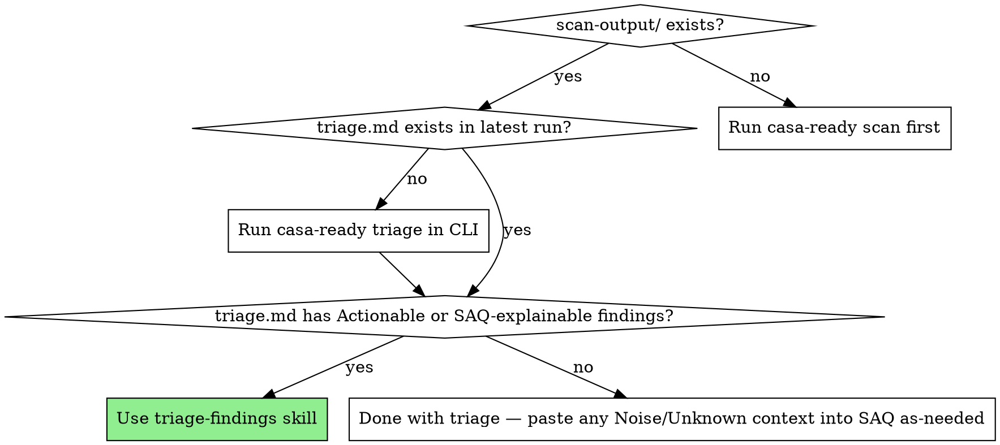

# V0.5.0 — Triage CLI + `triage-findings` Skill — Design

> **Status:** Spec ready for implementation. Brainstormed 2026-05-01.
> **Next step:** invoke `superpowers:writing-plans` to produce the implementation plan.

## Goal

Ship the first piece of the casa-ready Claude Code plugin alongside a matching CLI command, so a developer working in Claude Code can triage their CASA scan findings — getting Actionable items routed to concrete code patches and SAQ-explainable items routed to ready-to-paste SAQ answer text.

## Strategic frame

This is the first slice of a larger vision: a `casa-ready` Claude Code plugin that walks a developer through the entire CASA Tier 2 prep pipeline.

Full vision (multi-version):
```
Dev opens Claude Code in their app's repo
  → "help me get CASA certified"
    → casa-ready:getting-started skill loads
      → configure-scan → run-scan → triage-findings → complete-saq → submit-to-tac → annual-recert
```

V0.5.0 delivers `triage-findings` (and the CLI work that backs it). The other skills are explicit follow-ons in V0.6.0+.

The plugin is the primary product; the CLI is the worker layer underneath. Claude Code is a prerequisite — users find casa-ready via the Claude plugin ecosystem, not via npmjs.com. (CI users running the CLI standalone are a documented secondary path, not the headline.)

We model casa-ready's plugin + skill structure on the `obra/superpowers` framework. Superpowers turns Claude from a "I know how to do this" tool into a "here's the disciplined process to do this right" tool. CASA submission is exactly the kind of complex multi-step compliance workflow that benefits from the same disciplined-process scaffolding.

## Architecture

Three layers, clean separation:

```
┌─────────────────────────────────────────────────────────────┐
│  Claude Code (user's IDE)                                    │
│                                                              │
│  ┌─────────────────────────────────────────────────────┐    │
│  │  casa-ready PLUGIN (~/.claude/plugins/casa-ready/)   │    │
│  │     skills/triage-findings/SKILL.md                  │    │
│  │     skills/_vendored/systematic-debugging/SKILL.md   │    │
│  │     skills/_vendored/test-driven-development/SKILL.md│    │
│  └─────────────────────────────────────────────────────┘    │
│                          │  shells out to                    │
│                          ▼                                   │
│  ┌─────────────────────────────────────────────────────┐    │
│  │  casa-ready CLI (npm package, on PATH)               │    │
│  │     bin/casa-ready triage [path] [--target name]     │    │
│  │     ├── reads scan-output/<env>/<ts>/results.json    │    │
│  │     ├── loads configs/casa/rules/<alert-id>.md       │    │
│  │     ├── classifies findings using rules table        │    │
│  │     └── writes triage.md (aggregated cross-target)   │    │
│  └─────────────────────────────────────────────────────┘    │
└─────────────────────────────────────────────────────────────┘
                            │  reads
                            ▼
       ┌─────────────────────────────────────────┐
       │  configs/casa/rules/  (markdown KB)     │
       │     cross-domain-misconfiguration.md    │
       │     application-error-disclosure.md     │
       │     ... (one per ZAP alert type)        │
       └─────────────────────────────────────────┘
```

**Boundaries:**

1. **CLI ↔ ZAP results** — CLI reads `results.json` already produced by `scan`. JSON in, markdown out. No coupling to ZAP itself.

2. **CLI ↔ rules KB** — CLI globs `configs/casa/rules/*.md` at startup, parses YAML frontmatter, indexes by ZAP plugin ID. Rules are data, not code; coverage updates are markdown PRs.

3. **Skill ↔ CLI** — Skill shells out to `casa-ready triage`, reads the resulting `triage.md`, then for each Actionable finding opens the file the rule's "How to spot" section pointed at and drafts a patch using the user's actual code. Skill never re-classifies silently — it trusts the CLI's classification but verifies evidence before drafting patches.

**Key property:** All three layers ship in one repo (`casa-ready/`). New ZAP alert type = one PR adds the rule markdown, CLI picks it up, skill loads it for explanation. No multi-repo coordination.

## Tech stack

- Node 20+ (matching existing CLI)
- Existing internal libs: Zod for schema validation, `yaml` parser already in deps for casa-ready.yml
- New dep candidate: `gray-matter` for YAML frontmatter parsing in rules markdown (lightweight, ~50 LOC alternative also feasible inline)
- No runtime deps for the skill itself — markdown file with the superpowers idiom

## CLI command shape

### Invocation forms

```bash
casa-ready triage                          # zero-arg → newest scan-output/<env>/<ts>/
casa-ready triage <path>                   # explicit run dir
casa-ready triage --target <name>          # filter to one target within the chosen run
casa-ready triage --rules-dir <path>       # override built-in rules dir (CI / forks)
casa-ready triage --json                   # also emit triage.json alongside .md
```

### Output: `triage.md` at run root

For Magpipe's most recent scan: `scan-output/prod/2026-05-01T22-35-47-153Z/triage.md`. Always aggregated across all targets in the run (see "always aggregated" below).

### Output schema (the contract — skill reads this back and trusts it)

```markdown
# CASA Ready Triage — <run-id>

**Scan run:** scan-output/prod/<ts>
**Targets included:** api, web (4 OAuth callback targets failed — see Failures)
**Total findings:** 13 unique alert types, 52 instances
**Generated:** 2026-05-01 22:36 UTC

## Summary

| Category              | Unique alerts | Instances | Action required |
|-----------------------|---------------|-----------|-----------------|
| Actionable            | 2             | 5         | Code fix        |
| SAQ-explainable       | 4             | 31        | SAQ answer text |
| Noise (third-party)   | 5             | 12        | Dismiss         |
| Unknown               | 2             | 4         | Manual review   |

## Actionable

### Cross-Domain Misconfiguration (CWE-264, plugin 10098)

**Affected targets:** api, web (and the 4 OAuth callback targets that failed scanning)
**Instances:** 1 representative per target (5 total)
**Rule:** configs/casa/rules/cross-domain-misconfiguration.md
**Likely fix location:** look for CORS header configuration in your codebase
**Suggested SAQ section:** §2.4 (Network Security)

**Evidence (representative):**
- `https://hldlhskdpnyrqemyxidg.supabase.co/functions/v1/users` → response header `Access-Control-Allow-Origin: *`

**Why this is actionable:** Wildcard `Access-Control-Allow-Origin` on authenticated endpoints lets any origin read responses. CASA Tier 2 §2.4 expects an explicit allowlist. See the linked rule file for the standard fix pattern.

(... more Actionable findings ...)

## SAQ-explainable

(one entry per finding; rule file body provides the SAQ answer template)

## Noise (third-party)

(one entry per finding; reason for dismissal)

## Unknown

(one entry per finding; suggested next step is to open a PR adding a rule file)

## Failures

(one entry per target that failed to scan and produced no findings to triage)
```

### Exit codes

| Code | Meaning                                                |
|------|--------------------------------------------------------|
| 0    | Triage produced; zero Actionable findings              |
| 1    | Triage produced; one or more Actionable findings       |
| 2    | Could not produce triage (no scan output, parse error) |

The 0/1 split is the CI gate. A green build means "no actionable CASA findings."

### `--json` output

When `--json` flag set, also emit `triage.json` next to `triage.md`. Same data, structured for programmatic consumption. The skill prefers JSON when iterating over findings (lower prompt-token cost than parsing markdown). MD is the human/TAC-portal artifact; JSON is the machine artifact.

### Edge cases

- **Zero findings total** → `triage.md` is heading + "No findings to triage." Exit 0.
- **All findings are Unknown** → `triage.md` has only the Unknown section. Exit 0 (we don't escalate Unknown to Actionable; that's the skill's job to refine).
- **No scan output exists** → CLI exits 2 with hint: `Run casa-ready scan first`.

### Always aggregated

`triage.md` aggregates across all targets in the chosen scan run. Reason: cross-target findings (Magpipe's CORS finding affected `api`, `web`, and 4 OAuth callback targets — one fix in `_shared/cors.ts` resolved all of them) would be hidden by per-target triage. Aggregated output also matches how TAC reviews things: one submission, one set of findings.

`--target <name>` filters the *output* to one target's findings, but still produces a single file (not a per-target file).

### Next-step output (superpowers handoff pattern)

CLI's last-line behavior on `casa-ready triage`, when Actionable findings present:

```
✓ Triage complete. Wrote scan-output/prod/<ts>/triage.md (13 findings, 2 Actionable)

Next step:
  → Open Claude Code in this repo and ask "triage my CASA findings"
    The casa-ready:triage-findings skill will read triage.md, locate the
    Actionable findings in your code, and propose patches.

  (For CI: exit code 1 indicates Actionable findings present. Gate as needed.)
```

When zero Actionables but SAQ-explainable findings present:

```
✓ Triage complete. Wrote scan-output/prod/<ts>/triage.md (4 findings, 0 Actionable, 4 SAQ-explainable)

Next step:
  → No code changes needed. To refine the auto-drafted SAQ answer text with your
    specific evidence, open Claude Code and ask "help me refine my CASA SAQ answers"
    — the casa-ready:triage-findings skill will personalize the templates.
  → Or paste the SAQ-explainable section into your TAC submission as-is (works,
    but less specific than the skill-refined version).
```

When zero findings of any kind that need follow-up:

```
✓ Triage complete. Wrote scan-output/prod/<ts>/triage.md (0 findings).

Next step:
  → You're clear. Proceed to TAC portal upload.
```

`casa-ready scan` does NOT auto-run triage. Last line of `scan` output gets a hint pointing at `casa-ready triage`. Keeps commands composable for CI users who want their own gating.

## Markdown rules KB structure

Each ZAP alert type → one markdown file in `configs/casa/rules/<slug>.md`. CLI globs the dir at startup, parses frontmatter, indexes by ZAP plugin ID. Skill loads individual files when explaining specific findings.

### File schema (the contract)

```markdown
---
name: Cross-Domain Misconfiguration
slug: cross-domain-misconfiguration
zap_plugin_ids: [10098]                     # array — some alerts have multiple IDs
zap_alert_names:                             # array — text matching as fallback when ID missing
  - "Cross-Domain Misconfiguration"
cwe: 264
category: actionable                         # actionable | saq-explainable | noise
saq_section: "2.4"                           # optional, suggested SAQ question
saq_section_title: "Network Security"
severity_override: null                      # null = use ZAP's; or "high"/"medium"/"low"/"info"
fix_pattern: cors-allowlist                  # optional, links to a pattern doc (future)
applies_when:                                # optional rules to refine — null = always applies
  always: true
---

# Cross-Domain Misconfiguration

## What ZAP detects
(prose)

## Why this is "Actionable" for CASA
(prose with SAQ context)

## Standard fix pattern
(code block with the canonical fix; can include language-specific variants)

## How to spot the source in your code
(grep patterns, common file locations)

## SAQ answer template (if you can't ship the fix before submission)
(template prose with placeholders for user-specific details)
```

### Why frontmatter + body

- CLI only needs frontmatter for classification — fast parse
- Skill loads body to explain finding to user — rich CASA context, code patterns, SAQ templates
- Same file serves both consumers; one-PR-to-update model

### Initial coverage for v0.5.0 — 9 rule files

Only the alert types we've actually seen, not a speculative top-30:

From Magpipe + Juice Shop scans:
1. `cross-domain-misconfiguration.md` (actionable)
2. `application-error-disclosure.md` (saq-explainable)
3. `information-disclosure-suspicious-comments.md` (saq-explainable)
4. `information-disclosure-sensitive-info-in-url.md` (actionable — context-dependent)
5. `cross-domain-javascript-source-file-inclusion.md` (noise — third-party CDNs)

Plus four standard CASA-relevant header alerts that any web app trips:

6. `csp-header-not-set.md` (actionable)
7. `x-content-type-options-missing.md` (actionable)
8. `strict-transport-security-not-set.md` (actionable)
9. `x-frame-options-not-set.md` (actionable)

Anything not in the table → `Unknown` section in `triage.md`. Adding a rule = one PR.

### Lookup precedence in CLI

Match by `zap_plugin_ids` first; fall back to fuzzy `zap_alert_names` (handles ZAP version drift where plugin IDs sometimes change). Cache the index in memory per CLI invocation.

### Validation

A test asserts every `actionable` rule has a `saq_section` and a `fix_pattern`, every `noise` rule has a body explanation. Catches accidentally-shipped rule files with missing required fields. (See Testing section.)

## Skill body structure (`SKILL.md` for `triage-findings`)

The actual artifact users interact with through Claude. Strict superpowers idiom.

**File:** `plugin/skills/triage-findings/SKILL.md`

````markdown
---
name: triage-findings
description: Use after `casa-ready scan` when triage.md exists in scan-output/. Reads CASA findings, opens the user's actual code for Actionable items, drafts concrete patches, and produces SAQ-ready answer text for explainable findings.
---

# Triage CASA Findings

## Overview

After a CASA scan completes, ZAP produces 5–50+ findings per target. Most are noise or SAQ-explainable. The few that are real code issues need patches. This skill is the bridge: read `triage.md` (already classified by the CLI), verify the classification against the actual code, and produce the artifacts you need for both the fix PRs and the SAQ submission.

**Announce at start:** "I'm using the casa-ready:triage-findings skill to work through your scan findings."

## When to Use



**Note on flowchart:** Phase 4 of the skill drafts SAQ answer text using the user's specific evidence. Even when there are zero Actionable findings, loading the skill is still the recommended path *if any SAQ-explainable findings exist* — the skill personalizes the rule files' generic templates. Pasting the CLI's auto-generated SAQ-explainable section directly into TAC works as a fallback, but produces less specific answer text.

## REQUIRED SUB-SKILLS

You MUST use these when their conditions apply:

- **superpowers:_vendored/systematic-debugging** — REQUIRED before drafting any patch for an Actionable finding. The rule's "Standard fix pattern" is a starting point, not a guaranteed root cause for *your* codebase.
- **superpowers:_vendored/test-driven-development** — REQUIRED when writing patches that touch security-relevant code (CORS, headers, auth). Write the failing test first; prove the fix.

## The Process

You MUST complete each phase in order. Phase gates are explicit.

### Phase 1: Read the triage.md

1. Open the latest `scan-output/<env>/<ts>/triage.md`.
2. Note the counts in the Summary table. State them aloud: "I see N Actionable, M SAQ-explainable, K Noise, J Unknown."
3. Open `triage.json` if it exists — programmatic data, lower token cost than re-parsing markdown.

<HARD-GATE>
Do NOT proceed to Phase 2 until you have actually read triage.md. The CLI's classification is your starting point — but you cannot work from a summary you haven't read.
</HARD-GATE>

### Phase 2: Verify each finding's classification

For EACH finding in triage.md, in this order (Actionable → Unknown → SAQ-explainable → Noise):

1. Open the rule file the triage.md points at: `configs/casa/rules/<slug>.md`.
2. Read the rule's "What ZAP detects" and "Why this is..." sections.
3. Cross-reference with the *evidence* (URIs, response headers) in triage.md.
4. **If you disagree with the CLI's classification**, state it explicitly and propose a reclassification with reasoning. (Example: a `noise` finding where one of the instances is actually first-party — that instance becomes its own Actionable.)

<EXTREMELY-IMPORTANT>
Never re-classify silently. If you change a finding's category, surface it to the user and explain why. The CLI's rules table is the project's institutional knowledge — disagreeing with it is fine; doing so without telling the user is not.
</EXTREMELY-IMPORTANT>

### Phase 3: For each Actionable finding — locate, then patch

For each Actionable finding (and any reclassified-to-Actionable from Phase 2):

1. **Locate the source.** Use the rule's "How to spot the source in your code" section to grep the user's repo. Show what you found.
2. **Read the surrounding code.** Read at least the file containing the issue, not just the matching line.
3. **Apply the systematic-debugging skill** (REQUIRED) to verify the rule's standard fix pattern actually addresses *this* codebase's situation. Don't blindly apply.
4. **Apply the test-driven-development skill** (REQUIRED for security-relevant fixes) to write a regression test BEFORE the patch.
5. **Draft the patch.** Show the exact diff. Surface any judgment calls (e.g., "your ALLOWED_ORIGINS list should be these — confirm or adjust").
6. **Wait for user approval before editing files.** Per the user's standing rule: no UI/UX changes without confirmation; same here for security-sensitive changes.

<HARD-GATE>
Do NOT propose a patch for an Actionable finding until you have actually opened the file the rule's "How to spot" section pointed at, AND read its surrounding code. Without this gate, you will hallucinate fixes from the rule's generic CASA pattern that don't fit the user's actual code.
</HARD-GATE>

### Phase 4: For each SAQ-explainable finding — produce SAQ answer text

For each SAQ-explainable finding:

1. Read the rule file's "SAQ answer template" section.
2. Adapt the template using *the user's specific evidence* from triage.md (target names, URIs, instance counts).
3. Output the adapted answer text in a clearly-labeled block so the user can copy-paste into their SAQ portal later.
4. Do NOT edit any code for SAQ-explainable findings. Their resolution is documentation, not patching.

### Phase 5: Verify and hand off

1. List all proposed patches. Cross-check: did any single fix resolve findings on multiple targets? (Magpipe-style: one CORS fix resolved 5 targets.) If yes, surface that — fewer PRs to land.
2. List all drafted SAQ answers, grouped by suggested SAQ section.
3. List all Unknown findings unchanged. Suggest the user open a PR adding rule files for any that recur.
4. **Present the next step explicitly:**

   ```
   ✓ Triage complete.
     Patches drafted: <N>  (waiting on your approval to apply)
     SAQ answers drafted: <M>
     Unknown findings: <K>  (suggested PRs noted above)

   Next step:
     → Apply approved patches and re-run `casa-ready scan` to verify findings cleared
     → Save the SAQ answers — when casa-ready:complete-saq ships (V0.6.0), it will
       walk you through the SAQ portal using these as your starting drafts
     → For Unknown findings, consider opening PRs adding rule files

   Want me to /schedule a check-in next week to verify the patches landed and the
   re-scan is clean?
   ```

## Red Flags — STOP and re-enter the process

| Thought                                                          | Reality                                                                                              |
|------------------------------------------------------------------|------------------------------------------------------------------------------------------------------|
| "This is clearly Noise, I'll skip the verification"              | The CLI tagged it Noise based on a host pattern. You haven't verified the *content*. Verify.         |
| "I know the standard CORS fix, let me just write it"             | The rule's pattern fits *most* codebases. Yours might use a different shared module. Open the file.  |
| "This is the same finding on 5 targets, just one patch fixes all"| Maybe — but verify each target's evidence individually. Different targets can route differently.     |
| "User probably wants me to apply the patch"                      | Standing rule: never edit security-sensitive files without explicit approval. Show the diff, wait.   |
| "The Unknown finding looks similar to a known one, I'll group it"| You're guessing. Surface as Unknown, suggest PR.                                                     |

## Common Mistakes

| Mistake                                                              | Fix                                                                                       |
|----------------------------------------------------------------------|-------------------------------------------------------------------------------------------|
| Drafting a patch from the rule body without reading user's code      | Phase 3 gate exists for this. Read the file first.                                        |
| Re-classifying a finding silently                                    | Phase 2 EXTREMELY-IMPORTANT block. Surface every reclassification.                         |
| Skipping the regression test for a security fix                      | TDD is REQUIRED for Phase 3. Write the failing test, prove the patch.                     |
| Producing SAQ answer text without using the user's specific evidence  | Generic CASA prose is what TAC reviewers reject. Specifics from triage.md.                |
| Dead-ending without a "Next step" block                              | Phase 5 step 4 is non-negotiable. Always hand off.                                        |

## Integration

**Required sub-skills:**
- `superpowers:_vendored/systematic-debugging` (Phase 3)
- `superpowers:_vendored/test-driven-development` (Phase 3 for security fixes)

**Pairs with:**
- `casa-ready:run-scan` (V0.6.0+, the upstream skill that produces scan-output/)
- `casa-ready:complete-saq` (V0.6.0+, the downstream skill that consumes Phase 4's SAQ text)

**Called by:**
- `casa-ready:getting-started` (V0.7.0+, the workflow conductor)
````

### Companion files

For v0.5.0: none. Just `SKILL.md`. If we hit context-pollution problems that the superpowers framework solves with subagent dispatch templates, we'll add them in v0.5.x.

## Distribution + plugin manifest + install flow

### Final repo layout

```
casa-ready/
├── plugin/                                    ← THE PRODUCT (primary install)
│   ├── plugin.json                            ← marketplace manifest
│   ├── README.md                              ← plugin-specific README
│   └── skills/
│       ├── triage-findings/
│       │   └── SKILL.md
│       └── _vendored/
│           ├── systematic-debugging/
│           │   └── SKILL.md                   ← copied from obra/superpowers
│           └── test-driven-development/
│               └── SKILL.md                   ← copied from obra/superpowers
│
├── cli/                                       ← worker layer (npm package contents)
│   ├── commands/
│   │   ├── init.js                            ← existing
│   │   ├── scan.js                            ← existing
│   │   └── triage.js                          ← NEW
│   └── lib/
│       ├── ... (existing)
│       └── triage/                            ← NEW
│           ├── classify.js                    ← reads results.json + rules KB
│           ├── render-md.js                   ← writes triage.md
│           └── render-json.js                 ← writes triage.json
│
├── configs/casa/rules/                        ← markdown KB
│   ├── cross-domain-misconfiguration.md
│   ├── application-error-disclosure.md
│   ├── information-disclosure-suspicious-comments.md
│   ├── information-disclosure-sensitive-info-in-url.md
│   ├── cross-domain-javascript-source-file-inclusion.md
│   ├── csp-header-not-set.md
│   ├── x-content-type-options-missing.md
│   ├── strict-transport-security-not-set.md
│   └── x-frame-options-not-set.md
│
├── scripts/
│   └── sync-vendored.sh                       ← NEW: pulls latest superpowers skills
│
├── package.json                               ← still publishes CLI to npm for CI
├── README.md                                  ← REWRITE: plugin-primary framing
└── (existing files: bin/, configs/zap/, MIGRATION.md, CHANGELOG.md, etc.)
```

### `plugin/plugin.json` (best-guess shape)

```json
{
  "name": "casa-ready",
  "version": "0.5.0",
  "description": "Claude Code plugin for Google CASA Tier 2 security assessment workflow. Includes a bundled CLI (install separately via npm).",
  "author": {
    "name": "Snapsonic",
    "url": "https://snapsonic.com"
  },
  "homepage": "https://casaready.org",
  "repository": "https://github.com/elagerway/casa-ready",
  "license": "MIT",
  "skills": [
    "./skills/triage-findings",
    "./skills/_vendored/systematic-debugging",
    "./skills/_vendored/test-driven-development"
  ],
  "requires": {
    "claudeCode": ">=<verify-during-impl>",
    "binaries": [
      { "name": "casa-ready", "installHint": "npm install -g casa-ready", "minVersion": "0.5.0" }
    ]
  }
}
```

**Caveat:** Both `requires.claudeCode` (the version range) and `requires.binaries` (the binary dependency declaration) reflect the *desired* shape — declarative dependencies the plugin system would surface to the user. The current Claude plugin spec may not support either field. **Implementation phase will verify the actual schema and adapt** — worst case, drop `requires` entirely and have the `triage-findings` skill itself check for the CLI binary on first invocation. UX is identical; just where the check lives differs.

### Install flow for v0.5.0

```
Prerequisite: Claude Code is installed.

Step 1: Install the plugin from this repo
   $ claude plugin install https://github.com/elagerway/casa-ready

Step 2: First time you ask Claude to "triage my CASA findings", the skill checks
        if the `casa-ready` CLI binary is on PATH:
          - If present (≥ minVersion): proceed.
          - If missing: skill output asks
              "I need the casa-ready CLI to run scans + triage. Run this?
                 npm install -g casa-ready
               (Y/n)"
            — and runs it on Y, with explicit user confirmation.

Step 3: Done. Future invocations just work.
```

### `scripts/sync-vendored.sh` (drift management)

```bash
#!/usr/bin/env bash
# Refresh vendored superpowers skills from upstream.
# Run manually before each casa-ready release; eyeball the diff for behavioral changes.
set -euo pipefail
UPSTREAM="${1:-$HOME/.claude/plugins/cache/claude-plugins-official/superpowers/5.0.7/skills}"
DEST="$(dirname "$0")/../plugin/skills/_vendored"

for skill in systematic-debugging test-driven-development; do
  rm -rf "$DEST/$skill"
  cp -R "$UPSTREAM/$skill" "$DEST/$skill"
  echo "Refreshed $skill"
done

echo "Now diff against the previous version and commit if behavior changes look safe."
```

### npm package relationship

- npm package contents stay the same as v0.4.4 (CLI + configs + bin entry); `plugin/` is `.npmignore`d so the npm tarball doesn't bloat with skill files
- Plugin source lives in the same repo, so a single git PR updates both
- CI users (no Claude Code) install via `npm i -g casa-ready` and use only the CLI surface — `triage` command works standalone, produces TAC-ready triage.md
- README's primary install instruction switches to `claude plugin install ...`; a "Using the CLI standalone in CI" section preserves the npm-only path for that audience

### Marketplace future

- v0.5.0 ships via direct git URL install (above)
- v0.5.x: submit to `claude-plugins-official` marketplace once we've validated the install flow + had at least one external user beyond Magpipe successfully run end-to-end
- Marketplace submission is its own PR/process; doesn't gate v0.5.0

### README rewrite scope

- Primary install: `claude plugin install ...`
- Hero copy reframes from "open-source toolkit" to "Claude Code plugin for CASA Tier 2 (with bundled CLI)"
- "Using the CLI standalone in CI" section preserved for npm-only users
- All existing content (Quickstart, V2 migration, etc.) stays

## Testing strategy

Three test layers, mirroring the architecture, plus a fourth for the skill body.

### Layer 1: CLI unit tests (`tests/triage/`)

```
tests/triage/
├── classify.test.js                  ← rule-table classification logic
├── render-md.test.js                 ← markdown output structure
├── render-json.test.js               ← JSON output structure
└── fixtures/
    ├── magpipe-results.json          ← real Magpipe scan output (sanitized)
    ├── juice-shop-results.json       ← existing, reused
    ├── empty-scan.json               ← zero findings
    └── all-unknown-scan.json         ← all alerts unmapped
```

Coverage targets:
- `classify.js`: every rule file in `configs/casa/rules/` has at least one positive-match test using a real fixture finding. Ensures the rules table actually lights up against real ZAP output.
- `render-md.js`: snapshot tests for the four canonical states (mixed findings, zero findings, all-noise, all-unknown). Catches accidental schema changes that the skill depends on.
- `render-json.js`: validates against a JSON Schema (reuse Zod pattern already in deps).

### Layer 2: Rules KB validation (`tests/rules-kb.test.js`)

A single parser + linter test that loads every `configs/casa/rules/*.md` and asserts:

- Frontmatter parses (valid YAML)
- `category` is one of `actionable | saq-explainable | noise`
- Every `actionable` has `saq_section` and a non-empty body
- Every `noise` has a body section explaining *why* it's noise
- `zap_plugin_ids` is a non-empty array of integers
- No two rule files share a plugin ID (collisions would silently shadow)
- Every rule body has expected H2 sections matching its category

This single test is the gate that prevents shipping a half-written rule file.

### Layer 3: Integration smoke (`tests/integration/triage-e2e.test.js`)

Gated on `RUN_INTEGRATION=1` like existing smokes.

```
1. Run `casa-ready scan` against locally-running Juice Shop (existing harness)
2. Run `casa-ready triage`
3. Assert: triage.md file exists at expected path
4. Assert: triage.md has Summary table with non-zero counts
5. Assert: triage.md has at least one Actionable finding (Juice Shop trips CSP/HSTS reliably)
6. Assert: exit code is 1 (Actionable findings present)
7. Assert: triage.json exists and parses against schema
```

This is the "money smoke" — proves the full v0.5.0 pipeline works against a real scanned target.

### Layer 4: Skill body validation (`tests/plugin/skill-validate.test.js`)

Lints `plugin/skills/triage-findings/SKILL.md`:

- Frontmatter parses (valid YAML)
- `name` and `description` present and non-empty
- All `<HARD-GATE>`, `<EXTREMELY-IMPORTANT>` blocks have matching close tags
- Every "REQUIRED SUB-SKILL" path resolves to an actual file in `plugin/skills/_vendored/`
- The graphviz `dot` block in "When to use" parses (we don't render it, just verify syntax)

Same lint runs against vendored skill files — defends against `sync-vendored.sh` pulling something malformed from upstream.

### Test execution time budget

- Unit tests (Layers 1, 2, 4): under 5 seconds combined. Run on every save.
- Integration smoke (Layer 3): ~2 minutes (ZAP scan against Juice Shop). Manual + CI nightly.

### Out of scope for v0.5.0 testing

- The skill's actual *behavior in Claude* — does Claude correctly read triage.md and propose patches? Requires running Claude in a test harness. We'll know it works when we use it on Magpipe ourselves (dogfood, same as V2's "money feature" validation).
- The plugin install flow — manual smoke ("install plugin in fresh Claude Code, run triage skill, verify behavior") before each release. Automating plugin-install testing is its own project.

## Out of scope for v0.5.0

- Subagent dispatch templates (`./classifier-prompt.md`, `./patch-author-prompt.md`) — defer until we hit a context-pollution problem
- Marketplace submission — v0.5.x or v0.6.0
- Auto-install of the CLI from the skill's first prompt — v0.5.0 surfaces the install hint and asks for permission; "magic" auto-install is a follow-on
- Per-codebase rules overrides (`./casa-ready/rules/`) — not needed until external users run into rule mismatches
- Other casa-ready skills (`getting-started`, `configure-scan`, `run-scan`, `complete-saq`, `submit-to-tac`, `annual-recert`) — explicit V0.6.0+ work

## Acceptance criteria for v0.5.0 release

- `casa-ready triage` works against the existing Magpipe scan output and produces a `triage.md` consistent with the manual triage I produced 2026-05-01
- `casa-ready triage` against Juice Shop produces a `triage.md` with at least one Actionable finding (CSP/HSTS reliably trip)
- All four test layers pass; new fixtures added for the 9 rule files
- Plugin installable via `claude plugin install <git-url>`; `triage-findings` skill loads in Claude Code
- Skill successfully drafts a CORS-allowlist patch when run against Magpipe's existing CORS finding (replicates Phase 3 of the manual triage)
- README rewrite landed; plugin-primary framing is the headline
- `plugin/README.md` written (plugin-specific install + usage docs, distinct from repo README)
- Vendored superpowers skills present and pass Layer 4 validation
- CHANGELOG entry written

## Open questions for the implementation phase (non-blocking)

1. Exact `plugin.json` schema — verify against current Claude plugin spec; adapt if `requires.binaries` isn't supported.
2. `gray-matter` dep vs inline frontmatter parser — decide based on bundle weight.
3. Whether to add `casa-ready scan` → "next step: triage" hint on every scan run, or only when findings are present (probably the latter).
4. Initial vendored superpowers version to pin to (suggest 5.0.7, the current version on disk).
