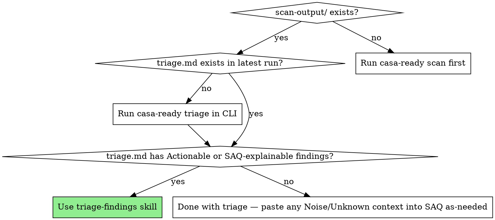

# Triage CASA Findings

## Overview

After a CASA scan completes, ZAP produces 5–50+ findings per target. Most are noise or SAQ-explainable. The few that are real code issues need patches. This skill is the bridge: read `triage.md` (already classified by the CLI), verify the classification against the actual code, and produce the artifacts you need for both the fix PRs and the SAQ submission.

**Announce at start:** "I'm using the casa-ready:triage-findings skill to work through your scan findings."

## When to Use



## REQUIRED SUB-SKILLS

You MUST use these when their conditions apply:

- **superpowers:_vendored/systematic-debugging** — REQUIRED before drafting any patch for an Actionable finding. The rule's "Standard fix pattern" is a starting point, not a guaranteed root cause for *your* codebase.
- **superpowers:_vendored/test-driven-development** — REQUIRED when writing patches that touch security-relevant code (CORS, headers, auth). Write the failing test first; prove the fix.

## The Process

You MUST complete each phase in order. Phase gates are explicit.

### Phase 1: Read the triage.md

1. Locate the latest `scan-output/<env>/<ts>/triage.md` (or use the path the user provides).
2. Open and read it fully. Don't skim.
3. Note the counts in the Summary table. State them aloud: "I see N Actionable, M SAQ-explainable, K Noise, J Unknown."
4. If a `triage.json` exists alongside, prefer it for programmatic iteration over findings (lower token cost than re-parsing markdown).

<HARD-GATE>
Do NOT proceed to Phase 2 until you have actually read triage.md. The CLI's classification is your starting point — but you cannot work from a summary you haven't read.
</HARD-GATE>

### Phase 2: Verify each finding's classification

For EACH finding in triage.md, in this order (Actionable → Unknown → SAQ-explainable → Noise):

1. Open the rule file the triage.md points at: `configs/casa/rules/<slug>.md`. (The CLI's rules KB ships with the casa-ready npm install; the rule file is in the `casa-ready` package's `configs/` directory. If the path isn't obvious, run `which casa-ready` and find the package install root.)
2. Read the rule's "What ZAP detects" and "Why this is..." sections.
3. Cross-reference with the *evidence* (URIs, response headers) in triage.md.
4. **If you disagree with the CLI's classification**, state it explicitly and propose a reclassification with reasoning. Example: a `noise` finding where one of the instances is actually first-party — that instance becomes its own Actionable.

<EXTREMELY-IMPORTANT>
Never re-classify silently. If you change a finding's category, surface it to the user and explain why. The CLI's rules table is the project's institutional knowledge — disagreeing with it is fine; doing so without telling the user is not.
</EXTREMELY-IMPORTANT>

### Phase 3: For each Actionable finding — locate, then patch

For each Actionable finding (and any reclassified-to-Actionable from Phase 2):

1. **Locate the source.** Use the rule's "How to spot the source in your code" section to grep the user's repo. Show what you found (file paths, matching lines).
2. **Read the surrounding code.** Read at least the file containing the issue, not just the matching line. Understand the context.
3. **Apply the systematic-debugging skill** (REQUIRED) to verify the rule's standard fix pattern actually addresses *this* codebase's situation. Don't blindly apply.
4. **Apply the test-driven-development skill** (REQUIRED for security-relevant fixes) to write a regression test BEFORE the patch.
5. **Draft the patch.** Show the exact diff. Surface any judgment calls (e.g., "your `ALLOWED_ORIGINS` list should be these — confirm or adjust").
6. **Wait for user approval before editing files.** Per the user's standing rule: no UI/UX changes without confirmation; same here for security-sensitive changes.

<HARD-GATE>
Do NOT propose a patch for an Actionable finding until you have actually opened the file the rule's "How to spot" section pointed at, AND read its surrounding code. Without this gate, you will hallucinate fixes from the rule's generic CASA pattern that don't fit the user's actual code.
</HARD-GATE>

### Phase 4: For each SAQ-explainable finding — produce SAQ answer text

For each SAQ-explainable finding:

1. Read the rule file's "SAQ answer template" section.
2. Adapt the template using *the user's specific evidence* from triage.md (target names, URIs, instance counts).
3. Output the adapted answer text in a clearly-labeled block so the user can copy-paste into their SAQ portal later.
4. Do NOT edit any code for SAQ-explainable findings. Their resolution is documentation, not patching.

### Phase 5: Verify and hand off

1. List all proposed patches. Cross-check: did any single fix resolve findings on multiple targets? (Common in practice: one CORS fix can resolve findings on 5 targets.) If yes, surface that — fewer PRs to land.
2. List all drafted SAQ answers, grouped by suggested SAQ section.
3. List all Unknown findings unchanged. Suggest the user open a PR adding rule files for any that recur.
4. **Present the next step explicitly:**

   ```
   ✓ Triage complete.
     Patches drafted: <N>  (waiting on your approval to apply)
     SAQ answers drafted: <M>
     Unknown findings: <K>  (suggested PRs noted above)

   Next step:
     → Apply approved patches and re-run `casa-ready scan` to verify findings cleared
     → Save the SAQ answers — when casa-ready:complete-saq ships (V0.6.0), it will
       walk you through the SAQ portal using these as your starting drafts
     → For Unknown findings, consider opening PRs adding rule files

   Want me to /schedule a check-in next week to verify the patches landed and the
   re-scan is clean?
   ```

## Red Flags — STOP and re-enter the process

| Thought                                                          | Reality                                                                                              |
|------------------------------------------------------------------|------------------------------------------------------------------------------------------------------|
| "This is clearly Noise, I'll skip the verification"              | The CLI tagged it Noise based on a host pattern. You haven't verified the *content*. Verify.         |
| "I know the standard CORS fix, let me just write it"             | The rule's pattern fits *most* codebases. Yours might use a different shared module. Open the file.  |
| "This is the same finding on 5 targets, just one patch fixes all"| Maybe — but verify each target's evidence individually. Different targets can route differently.     |
| "User probably wants me to apply the patch"                      | Standing rule: never edit security-sensitive files without explicit approval. Show the diff, wait.   |
| "The Unknown finding looks similar to a known one, I'll group it"| You're guessing. Surface as Unknown, suggest PR.                                                     |

## Common Mistakes

| Mistake                                                              | Fix                                                                                       |
|----------------------------------------------------------------------|-------------------------------------------------------------------------------------------|
| Drafting a patch from the rule body without reading user's code      | Phase 3 gate exists for this. Read the file first.                                        |
| Re-classifying a finding silently                                    | Phase 2 EXTREMELY-IMPORTANT block. Surface every reclassification.                         |
| Skipping the regression test for a security fix                      | TDD is REQUIRED for Phase 3. Write the failing test, prove the patch.                     |
| Producing SAQ answer text without using the user's specific evidence  | Generic CASA prose is what TAC reviewers reject. Specifics from triage.md.                |
| Dead-ending without a "Next step" block                              | Phase 5 step 4 is non-negotiable. Always hand off.                                        |

## Integration

**Required sub-skills:**
- `superpowers:_vendored/systematic-debugging` (Phase 3)
- `superpowers:_vendored/test-driven-development` (Phase 3 for security fixes)

**Pairs with:**
- `casa-ready:run-scan` (V0.6.0+, the upstream skill that produces scan-output/)
- `casa-ready:complete-saq` (V0.6.0+, the downstream skill that consumes Phase 4's SAQ text)

**Called by:**
- `casa-ready:getting-started` (V0.7.0+, the workflow conductor)
